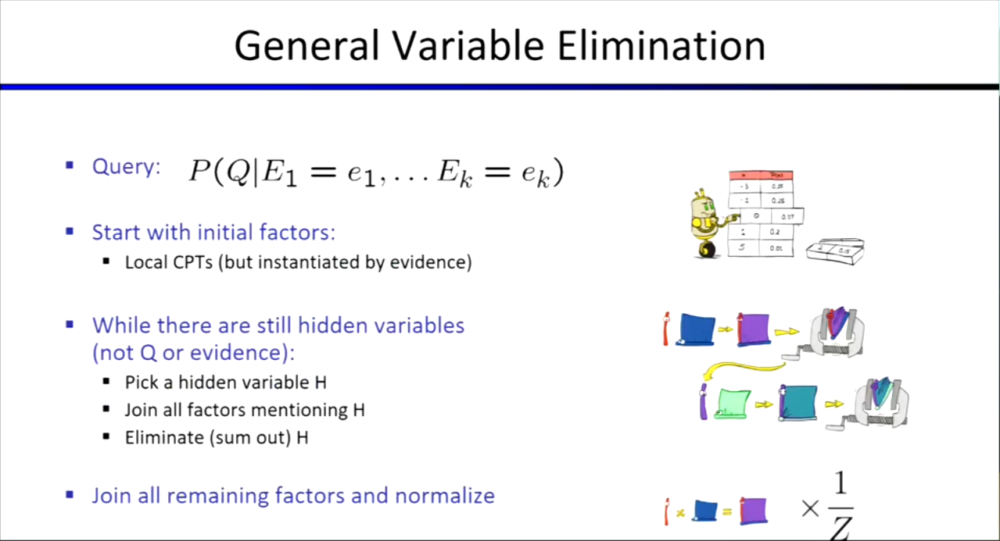

## 变量消除算法 (Variable Elimination, VE)
> **定义**：一种用于精确计算贝叶斯网络中条件概率查询的算法。

### 1. 核心操作
在消除一个隐藏变量 $v$ 时，核心步骤分为两步：
* **Join (相乘合并)**：把所有包含该变量的因素（Factors）聚集在一起，并将它们相乘，形成一个新的大表格。

* **Sum / Eliminate (求和消除)**：通过对变量 $v$ 求和操作（边缘化），从大表格中将该变量消除。

  

### 2. 消除顺序 (Elimination Order)
* **重要性**：消除顺序直接决定了中间生成的表格有多大（直接影响空间和时间复杂度）。
* **一般网络**：在任意复杂的图中，寻找绝对最优的消除顺序是一个 **NP-Hard 问题**。
* **多树结构 (Polytrees)**：
  * Polytree 是一种没有任何无向环路的网络结构。
  * 对于 Polytrees，总能找到一种高效的排序方法：只要总是**从叶子节点开始消除，向中心逼近**，变量消除算法的时间复杂度就是**线性**的。

## 近似推理：蒙特卡洛采样方法 (Sampling Methods)

### 1. 先验采样 (Prior Sampling)
* **原理**：在贝叶斯网络中，完全按照图的**拓扑结构**从上到下逐个生成随机样本。

### 2. 拒绝采样 (Rejection Sampling)
* **原理**：先进行先验采样，然后**拒绝（丢弃）所有不符合固定证据 (Fixed Evidence) 的样本**，只保留符合条件的。
* **缺点**：如果证据发生的概率很小，会导致拒绝率极高，算法生成有效样本的速度会非常慢。

### 3. 似然加权采样 (Likelihood Weighting Sampling)
* **原理**：为了避免丢弃样本，生成样本时直接固定证据变量的值，并根据证据变量发生的条件概率给整个样本赋予一个**权重 (Weight)**。
* **缺点**：抽样生成非证据变量时，**只考虑了上游信息，没考虑下游证据信息**。如果上游生成的变量导致下游证据发生的概率极低，算出来的权重就会非常小，最终导致大量样本权重趋于零，发生**样本退化**。

### 4. 吉布斯采样 (Gibbs Sampling)
* **原理**：抽样时不再是单向的，而是**考虑到网络中所有其他相关因素**，可以同时考虑来自上下游两个方向的 Evidence。
* **执行步骤**：
  1. 固定 Evidence 变量。
  2. 随机初始化所有非 Evidence 变量。
  3. 每次选择一个非 Evidence 变量，基于网络中其他所有变量的当前状态，计算其条件概率并进行**重新采样**，不断循环。
* **核心性质**：
  * 只要两次采样之间等待足够长的时间（步数足够多），样本间的相关性就会降低。
  * 经过**无限次重新采样**，它生成的样本分布将**完美等价于真实的后验概率分布**。
* **算法背景**：Gibbs Sampling 是著名的通用算法 **Metropolis-Hastings (MH)** 在特定条件下的一种简化特例，而 MH 算法属于强大的 **MCMC (马尔可夫链蒙特卡洛方法)** 家族。