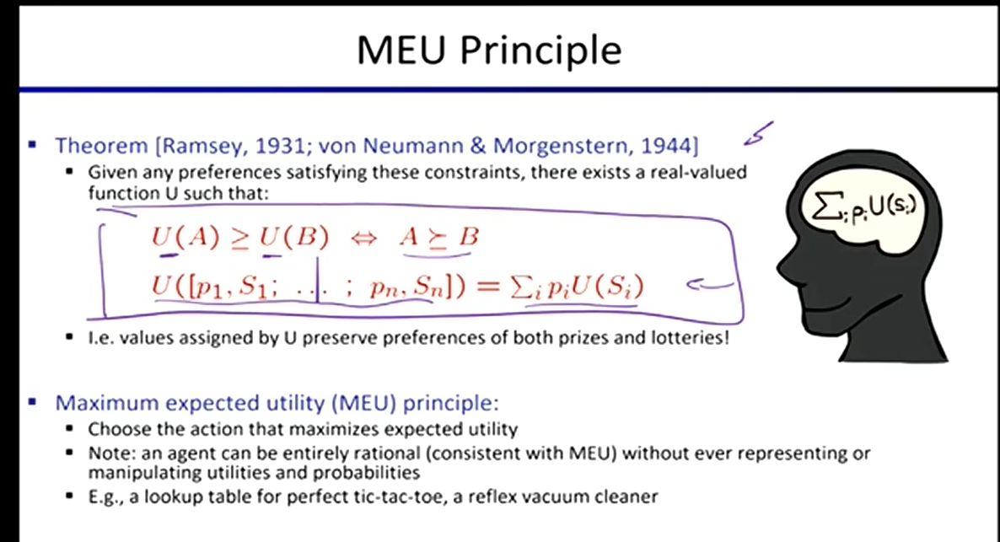

# 对抗搜索与游戏博弈 

## Game Tree

*   **西洋跳棋 (Checkers): Solved**
    *   “已解决”的意思是如果博弈双方都采用绝对最优的策略，游戏的结果是注定的（可以迫使某一方赢，或者迫使平局）。
*   **国际象棋 (Chess): Expert**
    *   IBM 的深蓝 (Deep Blue) 使用了一个非常复杂的评估函数、其他未公开的启发式方法，以及极深的搜索树。
*   **围棋 (Go): Expert**
    *   AlphaGo 使用**蒙特卡洛树搜索 (Monte Carlo Tree Search, MCTS)** 击败了人类世界冠军，同时利用深度学习实现了一个质量极高的评估函数。
    *   直观理解 MCTS: 让两个玩家从当前状态开始随机对弈多次，统计哪一方赢的次数更多，以此来评估当前位置是对哪一方更有利的局势。

## Deterministic Games

通常指没有随机性因素（如掷骰子）的完全信息博弈，例如各类棋类游戏。

#### 对抗性搜索 (Adversarial Search)
*   Agent 必须思考在你采取行动之后，你的对手（另一个 Agent）会采取什么行动？然后重复预测这个交互过程，直到游戏结束。

#### Minimax 算法 (极大极小算法)
*   假设双方都采取最优策略（我方试图最大化得分，敌方试图最小化我的得分）。

#### Alpha-Beta 剪枝 (Alpha-Beta Pruning)
*   **作用:** 在 Minimax 搜索树中剪去那些绝对不会被选中的分支，以减少计算量。
*   **局限:** 尽管能剪枝，但本质上依然是深度递归，在复杂游戏中仍有超时的可能。
*   如果能采用**完美的扩展顺序**来探索搜索树（先探索最容易被剪枝的节点），Alpha-Beta 剪枝的计算量将比常规的 Minimax 算法**减少到其平方根** ($O(b^{d/2})$ vs $O(b^d)$)。

#### 深度限制搜索 (Depth-Limited Search)
* 面对庞大的搜索树，即使有完美的 Alpha-Beta 剪枝，计算量依然可能过大。

* **解决方案:** 限制搜索的深度。不再搜索到真正的游戏结束，而是在达到深度限制的**终端节点 (Terminal Node)** 处停止。在深度限制的终端节点，使用评估函数算出的**估计值**来代替游戏结束时的实际值。

#### **协同作用** 
- 评估函数的质量需要不断改进。同时，评估函数不仅用于打分，它还能为 Alpha-Beta 剪枝提供依据：通过评估值对节点进行排序，**优先扩展最有希望的节点**，从而极大增加剪枝的数量和效率。

## 随机性游戏 (Stochastic Games)

通常指包含随机事件（环境不确定性）的游戏，比如需要掷骰子、抽牌的游戏。

#### Expectimax Search (期望极大算法)
*   **最大节点 :** 与 Minimax 算法中一样，我方依然选择能带来最大预期收益的动作。
*   **机会节点 (Chance Node):** 类似 Minimax 中的最小节点，但结果是不确定的，我们不再取最小值，而是计算**随机概率下的平均得分（期望值）**。
*   产生不确定性的这个 Chance Node，可能是对手，也可能是游戏环境本身。

#### 为什么要最大化预期效益 (Maximize Expected Utility)?
*   如果在**所有**决策中都采用极度悲观的 Minimax 算法，你将无法做出合理的现实选择。因为你总是担心接下来会发生最糟糕的情况，从而导致行动过于保守。
*   **效用与风险:** 一个东西或一种结果的**效用值 (Utility)**，本质上等于你为了得到它而愿意承担的**风险**大小。

#### 冯·诺依曼 - 摩根斯坦定理 (von Neumann-Morgenstern Theorem)

*   **核心结论:** 该定理告诉我们，只要你的偏好满足理性的约束条件（Rationality Constraints），那么在数学上，就**一定存在一个效用函数 $U$**，可以用来计算你对每种偏好（或奖品）的效用。
*   通过将所有可能结果的效用值与其发生的概率进行**加权求和** $\sum_i p_i U(S_i)$，可以精确地得出与你主观预期相符的理性决策结果。这就是“最大化期望效用 (MEU)”原则的底层数学基石。