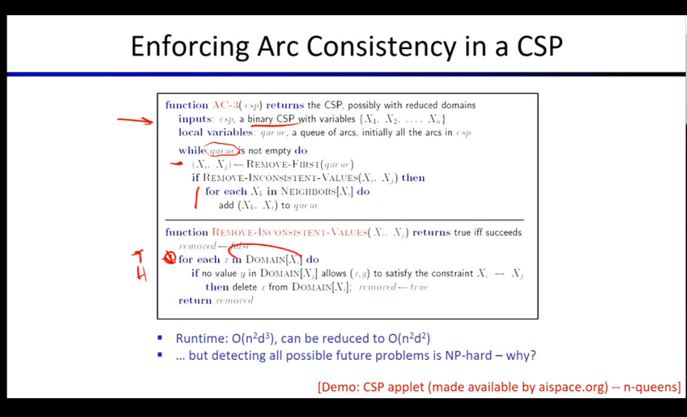

# 约束满足问题 

#  (Constraint Satisfaction Problems, CSPs)

尽管我们通常希望环境是单智能体、确定性的、完全可观测且离散的，但现实情况并不总是如此。

到目前为止，我们讨论的搜索问题被称为**规划问题**，其关注的核心是**动作序列**。除了规划问题，还有另一类问题，即**识别问题**。约束满足问题是识别问题中一类特殊的问题。

### CSPs 与 标准搜索的区别

*   **标准搜索**是一个黑盒，一种抽象的数据结构。你只能调用特定的函数来获取后继状态或检查当前状态是否为目标状态，但你无法了解状态内部的具体构成。
*   **约束满足问题**具有明确的内部结构。
    *   **状态 (State)** 被定义为各种**变量**及其**定义域**。
    *   **目标测试**被拆解为一系列的**约束**。这种结构化的表示使得算法可以执行一些高级操作，例如及早发现错误路径。

### CSP 的典型例子

*   **地图涂色问题 (Map Coloring)**
    *   **目标:** 为地图上的国家/州涂色，要求相邻的国家/州不能使用相同的颜色。
    *   **形式化为 CSP:**
        *   **第一步:** 定义变量，这里的变量就是地图上的各个州。
        *   **约束:** 可以隐式 (implicit) 表示（如代码逻辑 $V1 \neq V2$）或显式 (explicit) 表示（列出所有合法的取值对）。
    *   **解决方案:** 就是为所有变量找到一种合法的赋值组合。
*   **N 皇后问题 (N-Queens)**
    *   **目标:** 在 $N \times N$ 的棋盘上放置 $N$ 个皇后，使得它们互不威胁（不在同一行、同一列、同一对角线上）。

### 约束图 (Constraint Graph)

通过约束图，我们可以直观地看到**哪些节点（变量）通过约束相互连接**。虽然从图的拓扑结构上无法直接看出约束的具体规则是什么，但这对于分析问题结构非常有用。

### CSP 的标准搜索框架

在 CSP 的标准搜索框架中，**状态是由当前已赋值的变量来定义的**。

搜索过程就是在赋值的过程中逐步应用约束。最简单的实现方式是**回溯搜索 (Backtracking Search)**，即在遇到违反约束的问题时撤销最近的赋值并尝试其他选项。

为了提升回溯搜索的效率，通常采用以下三种方法：
1.  **排序 (Ordering):** 决定下一个要赋值的变量和要尝试的值的顺序。
2.  **过滤 (Filtering):** 在赋值过程中提前剔除不可能的值，缩减搜索空间。
3.  **利用图结构:** 检查约束图的高效特性，根据特定结构采用专门的算法。

#### 1. 过滤 (Filtering)

*   **前向检验 (Forward Checking):**
    *   **机制:** 跟踪未赋值变量的域，当当前赋值导致未赋值变量的某个选项违反约束时，将该选项划掉。
    *   **局限性:** 前向检验仅检查未分配变量与当前已分配变量之间是否存在直接冲突。因此，它无法提前发现未分配变量之间可能存在的、必然导致失败的冲突情况。

*   **约束传播 (Constraint Propagation) - 弧一致性 (Arc Consistency):**
    *   **机制:** 进行双向的检查。
    *   **核心规则:** 从弧的尾部变量域中开始删除值。
    *   **连锁反应:** 任何时候当你从一个变量的域中删除一个值时，所有指向该变量的、之前已经被声明为一致的弧，都**必须被重新审视**。因为刚刚被删除的那个值，可能正是支撑其他变量一致性的关键。
    *   **优势:** 如果我们逐一检查所有的弧并使其达到一致，一旦进行赋值，就能立即推断出该赋值在更广的范围内是否可行，从而发现未赋值变量之间的次级冲突。这是一种**约束传播**。
    *   **代价:** 每次赋值后都需要进行大量的检查工作，尽管这个过程最终是会收敛的。因此，在过滤的深度和计算成本之间存在取舍 (trade-off)。

#### AC-3 算法

*   AC-3 是一个用于使整个约束图达到**弧一致性**的经典算法。
*   **适用范围:** 该算法仅适用于二元 CSP (Binary CSPs，即约束仅涉及两个变量)。
*   **局限性:** 强制实施弧一致性**并不能完全避免回溯的发生**。通常情况下，它无法检测出涉及三个或更多节点之间的复杂环状冲突。尽管如此，相比于盲目搜索，它已经带来了巨大的性能提升。

#### 2. 排序 (Ordering)

在前面的讨论中，我们尚未考虑如何挑选下一个要处理的变量或值，这正是排序策略要解决的问题。

*   **变量排序：最小剩余值 (Minimum Remaining Values, MRV):**
    
    *   **思想:** 选择当前域中剩余可选值最少的变量。
    *   **又称:** 最受约束变量 或 快速失败排序。
    *   **原因:** 既然这个变量的选择余地最小，最容易引发冲突（迟早要面对），不如尽早处理它，以便尽早发现错误并及时回溯，避免在错误的路径上浪费时间。
    
*   **值排序：最少约束值 (Least Constraining Value, LCV):**
    * **思想:** 给定一个变量后，选择对其邻居变量域影响最小（排除的值最少）的那个值。
    
    * **代价:** 要知道哪个值受约束最少，通常需要在过滤算法中进行大量的预先计算。
    
- **为什么变量选“最难”而值选“最易”？** 因为在 CSP 求解过程中，你最终**必须**为每一个变量赋一个值，但你**不需要**处理每一个值。

将排序与弧一致性结合起来，我们就能得到一个相当不错的启发式求解方法。然而，面对超大规模的 CSP 问题，精确求解仍然极具挑战，后续需要探讨针对大规模问题的其他技术手段。

---

### 补充

*   **P 问题:** 很简单，可以在多项式时间内**求解**的问题。
*   **NP 问题:** 求解可能很难，但如果给定一个候选答案，可以在多项式时间内轻松**验证**其是否正确。
*   **NP-Hard:** 极度困难。是指难度**至少**和 NP 问题中最难的问题一样难的问题。NP-Hard 问题甚至可能连“验证答案”都很困难，或者根本就是完全无解的。
*   **NP-Complete :** 同时满足是 NP 问题且是 NP-Hard 问题的交集，即 **NP-Complete = NP ∩ NP-Hard**。它们是 NP 中最难的问题。