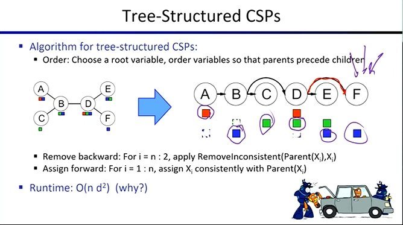
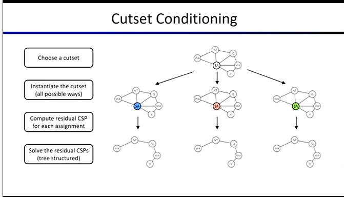
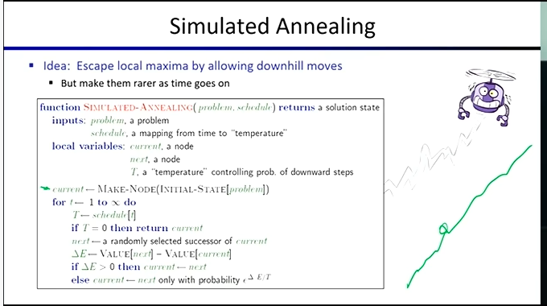

# 约束满足问题 (CSPs) 进阶与局部搜索

## 高阶一致性

*   **k-Consistency**
    *   不仅确保所有弧（两个节点）遵守规则，还要确保所有的三元组、四元组也都遵守规则。
    *   **定义:** 对于每 $k$ 个节点的集合，如果你能为其中任意 $k-1$ 个节点找到合法的赋值组合，那么必然存在一个对第 $k$ 个节点的赋值，使得这 $k$ 个节点的整体赋值不违反任何约束。
    *   *弧一致性即 **2-Consistency**（给定 1 个节点的合法赋值，能找到第 2 个节点的合法赋值）。*
*   **Strong k-Consistency**
    *   一个 CSP 如果是**Strong k-Consistency**的，意味着它同时也是 $(k-1)$、$(k-2)$ ... Consistency的。
*   在本课程中，只用掌握**弧一致性**，但了解高阶一致性的概念对于深入理解 CSP 也很重要。

## 利用图结构优化求解

如果能将一个庞大的 CSP 分解成一系列完全**独立**的子问题，那么解决时间可能连一秒都不到。如果问题具有独立性，就可以采用“分而治之”的策略。
*   但现实中几乎不会遇到完全独立、可以完美拆分的 CSP。
*   尽管如此，这告诉我们：**深入考虑约束图的拓扑结构，可能揭示出更快、更高效的解决方法。**

#### 树状结构 CSP 的算法

*   **定理:** 如果一个约束图**没有环路**（即它是一棵树），那么这个 CSP 问题可以在**多项式时间**内解决。
*   **时间复杂度:** 其运行时间主要与域的大小呈二次方关系 ($O(n d^2)$)。这比一般图结构下指数级的 $O(d^n)$ 要好得多。
*   **算法利用的特性:** 树结构的一个关键特性是，在一个有向树（拓扑排序后）中，**每个节点只有一条弧指向它**（只有一个父节点）。这使得我们可以通过“从叶到根的移除不一致值”再“从根到叶的赋值”来实现高效求解。

#### 处理近似树状结构的方法

在现实中，直接找到纯树状结构的图是不切实际的，但我们可以想办法将“接近树结构”的图**转换**为树结构。

**1. 割集条件化**

*   **思想:** 通过给少部分关键节点（割集）赋值，将原本有环的图“切断”变成树状。
*   **步骤:**
    1.  选择一个割集（一小群节点）。
    2.  尝试割集节点的所有可能赋值方式，再去解决剩余的子图问题。
    3.  如果剩余的部分变成**独立的** 或 **树状的** 或 任何你知道如何有效处理的结构就能很快解决。
    5.  将子图的解与割集的赋值结合，得到原图的解。
*   **难点:** 找出能使剩余图变成树的**最小割集**本身就是一个 NP-Hard 问题（“这是一门 AI 课程，所有有意思的问题几乎都是 NP-Hard 的”）。

**2.分组**

*   **思想:** 将原问题分解成许多子问题，约束条件要求在处理这些子问题时，确保它们之间共有的变量必须以相同的方式被赋值。
*   **效果:** 在正确的设置和划分下，这些“超级节点”之间将呈现出树状结构，从而可以利用树结构的优势进行求解。（这里不深入探讨此方法的具体细节）。

## 从 CSP 搜索到局部搜索 (Local Search)

目前为止，我们讨论的解决 CSP 的策略（如回溯、前向检验、弧一致性）本质上都是搜索。

#### 迭代改进
*   迭代改进是我们首次接触到的**随机化算法**，这种思想可以推广到一般的局部搜索方法中。
*   **最小冲突的迭代算法**
    *   **步骤:** 首先给所有变量分配一个完整但可能存在冲突的初始解。然后随机选择一个卷入冲突的节点，更改它的赋值，使其以**最小化当前冲突数量**的方式取值。
    *   **特点:** 尽管这种方法在理论上几乎无法提供任何找到最优解的保证，但在许多实际情况下（如 N 皇后问题、大型排课问题）却**非常有效且快速**。

#### 局部搜索
*   **基本原理:** 从状态空间中的任意一个起点（初始状态）出发，仅评估其周围的邻居节点，并**向最佳的临近状态移动**（通常是爬山法）。如果周围没有任何相邻状态优于当前状态，则停止搜索。

#### 模拟退火 (Simulated Annealing)

*   **本质:** 一种改进的局部搜索算法，旨在解决传统爬山法容易陷入局部最优解的问题。它是少数几种具备性能保障的启发式搜索方法之一。
*   **核心机制:**
    *   为了逃离局部最优，算法会有概率接受一个“更差”的状态。
    *   如果随机挑选的后续状态更好（$\Delta E > 0$），那就采纳；如果更糟，仍以一定概率（通常为 $e^{\Delta E / T}$）接受它。状态越糟，或温度越低，接受的概率就越小。
    *   随着时间推移，系统的“温度”逐渐降低。温度越高，接受糟糕状态的概率越大；温度降至零时，退化为纯粹的贪心爬山法，停止随机跳跃。
*   **理论保证与现实困境:**
    *   *理论上:* 只要足够缓慢地降低温度，算法最终就能收敛到全局最优状态。
    *   *实际上:* 在任何有限的、现实的时间尺度内，这种保证往往不成立。因为在复杂的高维地形中，要逃离一个深坑（局部最优解），可能需要连续采取多次“下坡”步骤，而连续满足极低概率事件的可能性微乎其微。

#### 探索解空间的其他途径
由于仅靠小范围的局部扰动（如模拟退火）容易受困，人们开始致力于创造能以更优方式在解空间中进行大跨度跳跃的算子（Ridge operators），甚至采用完全不同的隐喻。

*   **遗传算法 (Genetic Algorithms):**
    *   **应用自然隐喻:** 维护一群候选解（种群）。
    *   **机制:** 评估每个个体的适应度。优秀的个体被复制（保留），糟糕的被淘汰。然后将存活下来的个体进行重组，产生下一代。
    *   **特点:** 它不局限于针对单个状态进行局部微调，而是采用群体并行、信息交换的完全不同的方式来广阔地探索解空间，并常常结合多次重启来提高找到全局最优解的几率。