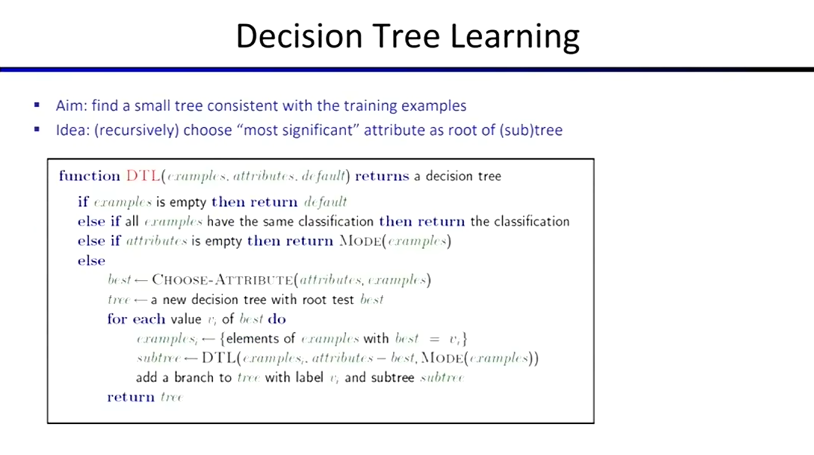

算法天生偏爱“一致性”，在没有任何限制的情况下，只要训练误差还没有降到 0，算法就会不断地增加自身的复杂度去迎合训练数据。这种过度迎合数据中噪音的行为会导致**过拟合 (Overfitting)**。

#### 两种防止过拟合的方法

为了防止过拟合，我们通常从以下两个方向入手：

* **限制假设空间 (Restrict Hypothesis Space)**
  强行减少模型可以学习的复杂模式。
  * **朴素贝叶斯 (Naive Bayes)** 强行假设特征之间绝对独立，直接砍掉了学习特征之间复杂关系的可能性。
  * **特征选择 (Feature Selection)**，只给模型提供更少、更优的特征，排除冗余干扰。

* **规范从假设空间中进行选择的方式 (Regularization)**
  允许模型复杂，但对过度复杂的选择进行惩罚。
  * **正则化的本质**：在目标函数中加入**惩罚项 (Penalty Term)**。
  * **拉普拉斯平滑 (Laplace Smoothing)**，即使没见过的数据也给个基础概率，避免模型对训练集给出绝对的 100% 或 0% 概率。

## 决策树学习 (Decision Tree Learning)

> **核心目标 (Aim)**：找到一棵与训练样本一致的、尽可能**小**的树。
> **核心思想 (Idea)**：（递归地）选择“最显著”的属性作为（子）树的根节点。

- 决策树像一棵树一样，根据特征不断向下分割产生分支。但如果只是简单地无限向下分割，树的规模会大得惊人。这样虽然能完美拟合训练数据中的所有模式，但必然会导致严重的过拟合。问题在于如何**科学地进行分割**。

#### 分割标准：熵与信息增益

我们使用**熵 (Entropy)** 来确定要根据哪些属性进行拆分。

* **熵 (Entropy, $H$)**：用于量化数据分布中的不确定性大小。
  * **计算公式**：$$ H = \sum_{i=1}^n -p_i \log_2 p_i $$
* 因为分割的目的是为了**降低不确定性**，我们会计算属性分割前后的熵的变化。如果熵减少了，就产生了一个 Information Gain。选择最佳属性（信息增益最大）作为根节点，生成新的子树，说明我们选择了一个很好的分割方式。

#### 决策树生成算法 (DTL 算法)

生成决策树的代码逻辑是一步步递归得来的，

1. **Base Cases (终止条件)**：
   * 样本为空 $\rightarrow$ 返回默认分类。
   * 样本全属于同一分类 $\rightarrow$ 返回该分类。
   * 属性用完了 $\rightarrow$ 返回当前样本的众数 (`MODE`)。
2. **Recursive Step (递归分割)**：
   * 执行 `CHOOSE-ATTRIBUTE` 选出最佳属性 `best`。
   * 针对 `best` 的每一个可能取值划分子集，递归调用 `DTL` 生成子树并挂载到当前节点。

- 在实际操作中还会先构建整颗树，再沿着树向上进行第二次构建，去除不符合标准的枝条。但也不能光看熵下降了多少（信息增益有多大），当节点分到最后，样本量极小的时候，任何微小的随机特征都可能把数据完美分开，但这是没有意义的噪音拟合。此时必须引入显著性检验作为**刹车片**。如果发现某次分裂大概率**只是运气使然**（偶然性导致的不确定性下降），就果断进行 **Pruning（剪枝）**。