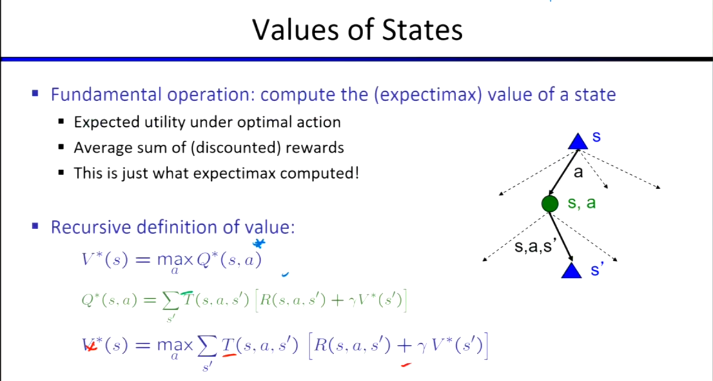
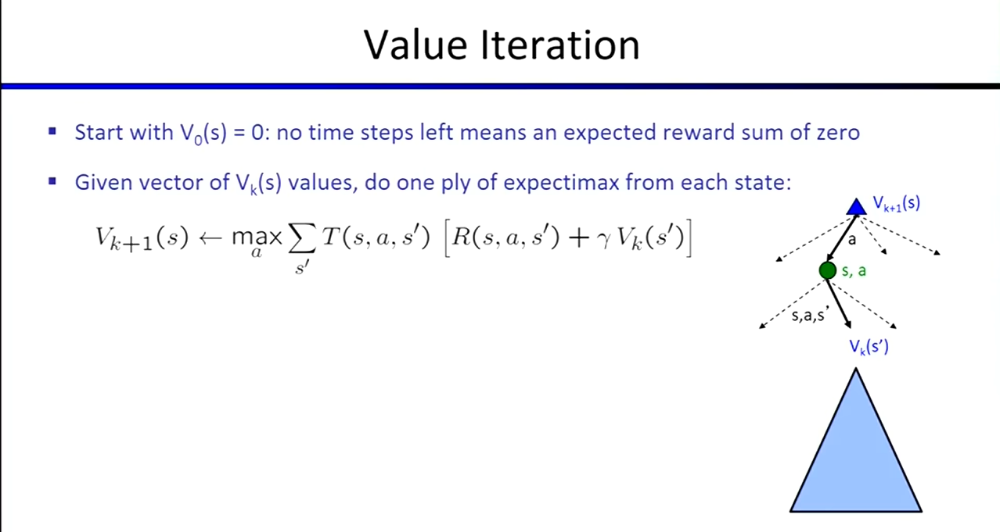

# 马尔可夫决策过程 (MDP) 

MDP 是一类处理**不确定性搜索问题**的数学框架，解决的一个方法是之前学过的 Expectimax Search （期望极大化搜索）。

- **马尔可夫 **一词通常意味着“**给定当前状态，过去与将来是独立的**。”

* **在 MDP 中的体现：** 采取某个动作后的结果（下一个状态的分布），**只依赖于当前状态和当前动作**，而与它过去是如何到达这个状态的“历史轨迹”完全无关。

#### 计划 (Plan) vs. 策略 (Policy)

* 在确定性的 **Single Agent Search** 中我们希望输出是一个 **Plan**，即一系列动作序列（如：前进 $\rightarrow$ 左转 $\rightarrow$ 抓取）。
* 在更嘈杂、充满随机性的世界中，事情并不一定按计划进行（可能会滑倒、失败），所以不能用固定的 Plan，而必须使用 **Policy（策略，$\pi$）**。
  * **策略是一个函数** ，它能根据系统可能所处的*任何状态*，告诉智能体该做什么动作（$\pi: S \rightarrow A$）。
  * **MDP目标：** 寻找**最优策略 ($\pi^*$)**，以最大化预期的总效用。策略的制定和计算通常是一个离线 (Offline) 过程。

## Solving MDPs

当环境的参数（状态转移概率 $P$、奖励函数 $R$）完全已知时，我们基于**动态规划 (DP)** 来求解 MDP。

* **Reward 不一定等于 Utility：** Reward 是每走一步当下立刻获得的即时反馈；而某一行动下的预期 Utility 是未来所有 **Discounted Reward 的平均总和**。我们真正要最大化的是长期的 Utility。

#### 贝尔曼方程 (Bellman Equation)

* **操作：** 计算一个状态在“最佳行动下的最大期望值”。
* **一步前瞻 (One-step Look-ahead)：** 贝尔曼方程给出了 Value (状态价值) 的递归定义，将一个状态的最优值与其后继状态的最优值联系了起来。
  $$V^*(s) = \max_a \sum_{s'} P(s'|s,a)[R(s,a,s') + \gamma V^*(s')]$$

#### 值迭代 (Value Iteration)

* **计算过程：** 从 $k=0$（剩余 0 个时间步，预期奖励总和为 0）开始算起，**一步步往回推**。
* 就相当于在已知 $k$ 步价值的基础上，套用贝尔曼方程做一次“一步前瞻”，就可以算出剩余 $k+1$ 步时的状态价值。

#### V值 vs. Q值

* **V-value (状态价值)：** 知道 V 值后，如果你想在当前状态提取出最优动作，你必须**重新做一次一步前瞻**（需要用到环境的模型参数 $P$ 和 $R$）。
* **Q-value (动作价值)：** 如果你直接知道 Q 值，选择动作就变得极其简单：直接挑那个 Q 值最大的动作即可（$a^* = \arg\max_a Q(s,a)$）。
* “从 Q 值中选择行动要比从 V 值容易得多”这一观察，开启了现代**强化学习 (Reinforcement Learning)** 的大门！

当存在一个MDP但不知道任何参数，实际上也是如此，只能通过与世界互动来了解事情，那么就需要强化学习。

### 