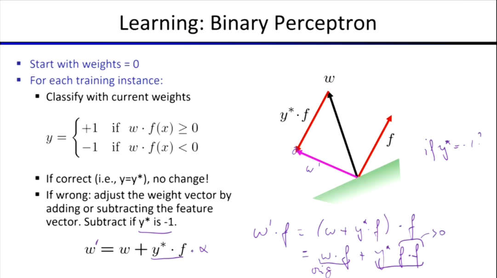
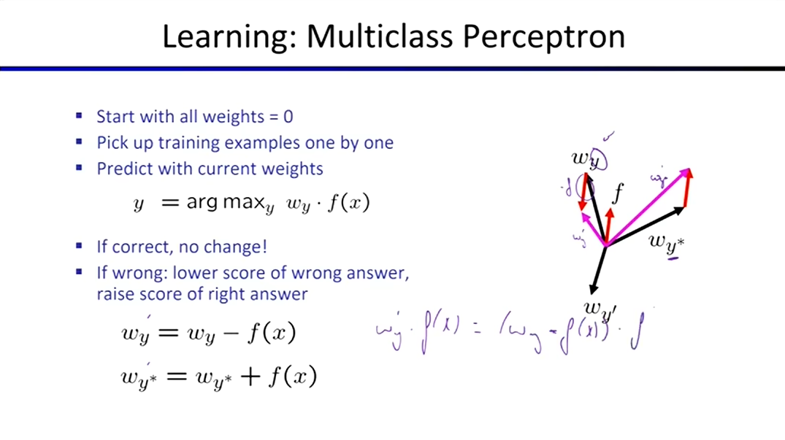
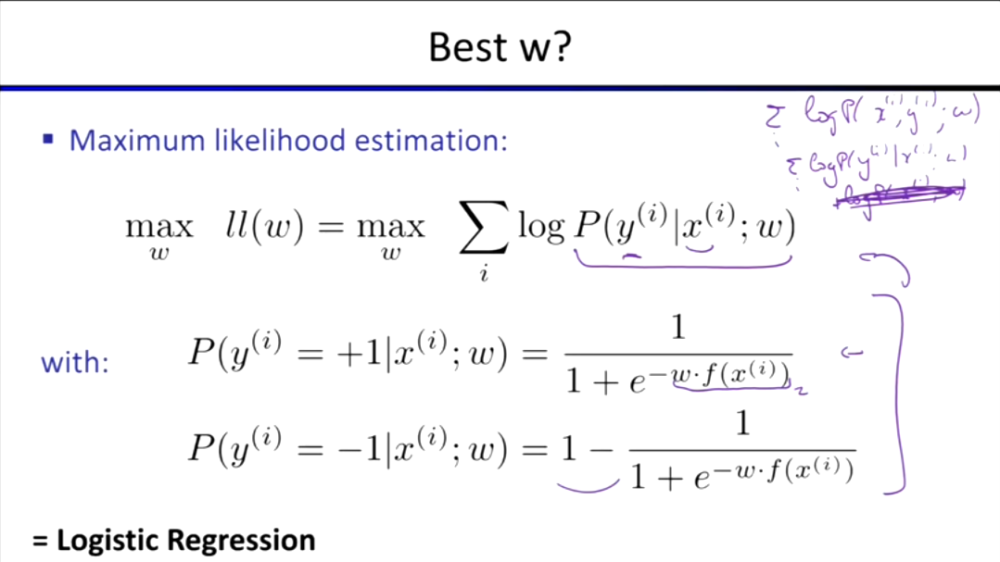
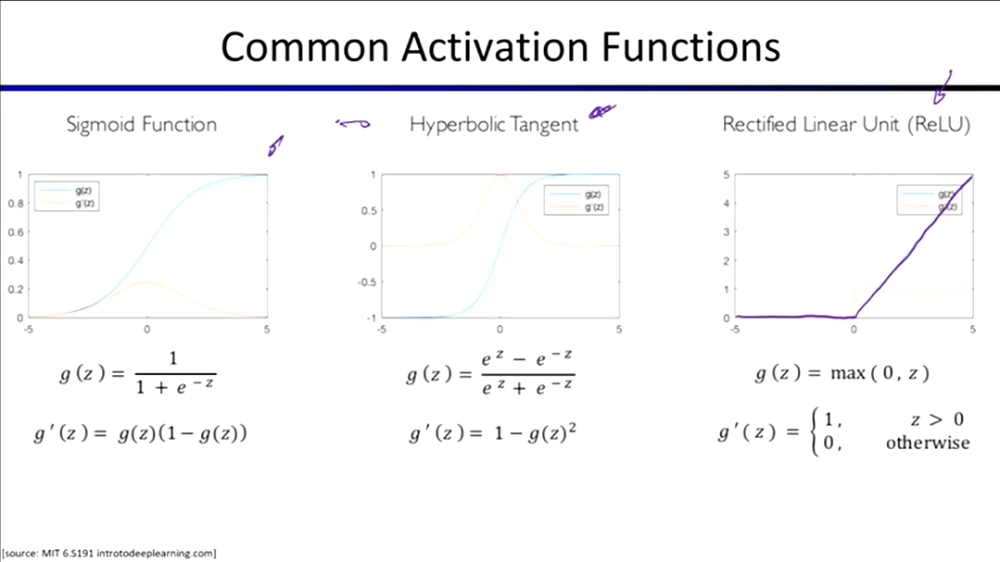
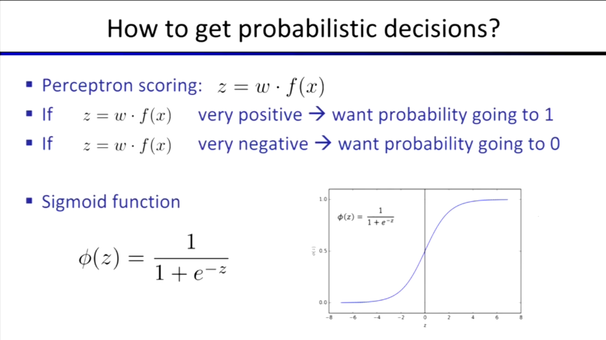
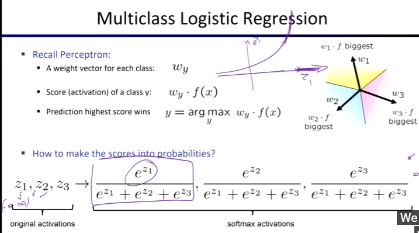

前面所学大多关于如何使用一个已有的模型做出最优决策，第一部分考虑行动顺序，第二部分在不确定性中进行推理。而 **机器学习 (Machine Learning)** 研究如何**从数据和经验中获取模型**，以及如何获取模型的参数。

---

## 分类模型基础 (Classification)

#### 朴素贝叶斯 (Naive Bayes)

* **模型类型**：生成式模型 (Generative Model)。
* **基本假设**：标签 (Label) 生成了特征 (Features)。标签是唯一的父节点，所有特征都是它的子节点。

#### 过拟合与泛化 (Overfitting and Generalization)

* **机制差异**：过拟合的具体机制因模型而异。在朴素贝叶斯中，通常表现为抽样方差过大（例如在概率计算中出现极端值 0）。
* **解决方案**：缩小假设空间，使用**正则化函数 (Regularization)** 或**平滑函数 (Smoothing)** 使概率分布更加平坦。

## 感知机 (Perceptron)
感知机分为 **二元感知机 (Binary Perceptron)** 

和 **多元感知机 (Multiclass Perceptron)**。

#### 感知机的核心缺陷：

1. 面对不可分离的分布，感知机永远无法达到收敛。
2. 只要边界刚好把当前数据划分开，感知机就会达到收敛并停止更新。这导致它找出的边界往往效果不是最好的（泛化能力差）。
* 感知机的过拟合问题可以通过**提前停止 (Early Stopping)** 来解决。

## 逻辑回归 vs 朴素贝叶斯
这两种算法代表了机器学习中两种不同的核心流派：

#### 逻辑回归 (Logistic Regression) —— 判别式模型 (Discriminative)

* 不关心输入特征 $x$ 本身是怎么产生的（即不管 $\log P(x)$），只专注于**“给定 $x$ 怎么划分决策边界把 $y$ 区分开”**。
* 优化目标是**最大条件似然估计 (Maximum Conditional Likelihood Estimation)**。找出了一组最完美的权重 $w$，使得“在看到特征 $x$ 后，模型预测出正确标签 $y$ 的概率”最大化。

#### 朴素贝叶斯 (Naive Bayes) —— 生成式模型 (Generative)

* 最大化**联合似然估计** $\sum \log P(y,x)$，朴素贝叶斯不仅要学习特征 $x$ 怎么推导出标签 $y$，还要学习特征 $x$ 本身的概率分布规律。

## 最优化算法：梯度下降 (Gradient Descent)
为了找到逻辑回归或神经网络中那组完美的权重 $w$，我们需要使用梯度上升/下降算法。常用的有三种：

1. **批量梯度下降 (Batch Gradient Descent, BGD)**
   * **机制**：每次更新前，计算**所有**训练样本的梯度，求和后更新 $w$。
   * **优缺点**：方向最准，直接指向最优解；但是更新速度极慢，且极其消耗内存。
2. **随机梯度下降 (Stochastic Gradient Descent, SGD)**
   * **机制**：每次只随机抽取 **1个** 样本，只算这一个样本的梯度，立刻更新 $w$。
   * **优缺点**：更新速度极快；但因为每次只看一个样本，下降方向非常盲目和随机。
3. **小批量梯度下降 (Mini-batch Gradient Descent, MBGD)**
   * **机制**：每次从数据集中抽取**一小批**样本（如 32、64 或 128 个），计算这一小批样本的梯度和，然后更新 $w$。
   * **优缺点**：既保证了方向比较准确，又保证了更新频率。更重要的是，它能**完美契合 GPU 的矩阵并行计算能力**，是目前深度学习中**最常用**的方法。

## 激活函数 (Activation Functions)

#### 为什么要引入激活函数？

- 在线性计算（$w \cdot x$）之后，必须通过非线性的激活函数来学习非线性特征。它能为网络**增加足够的灵活性，以捕捉数据中复杂的非线性模式**。

#### 通用函数逼近理论 (Universal Approximation Theorem)

- 只要网络足够大（神经元足够多），包含非线性激活函数的神经网络就可以近似**任何连续映射函数**。

#### 分类任务中常见的输出层激活函数：

* **Sigmoid 函数**：通常用于 **二分类 (Binary Classification)** 任务，将得分映射到 0 到 1 之间的概率。

* **Softmax 函数**：通常用于 **多分类 (Multiclass Classification)** 任务，将多个类别的得分转化为总和为 1 的概率分布（即多元逻辑回归）。

