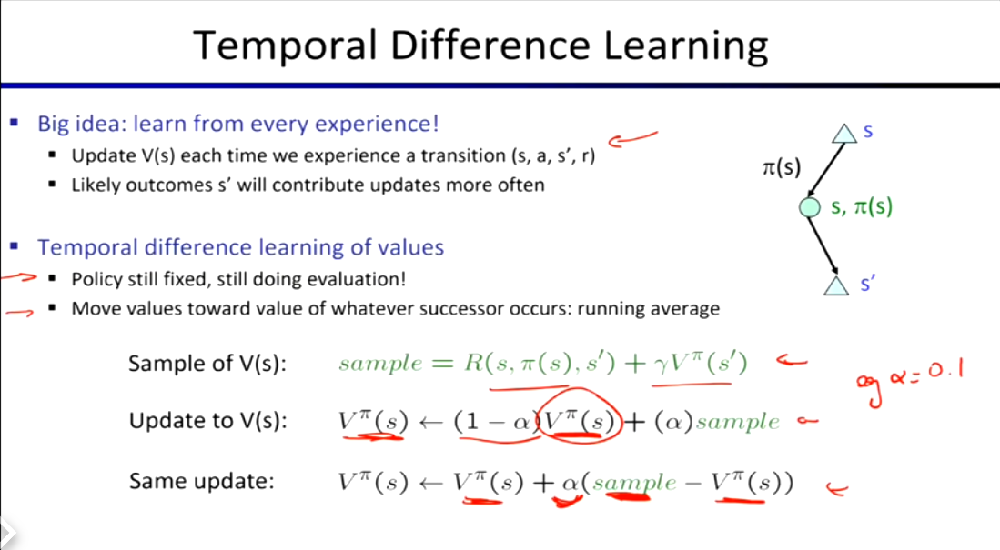
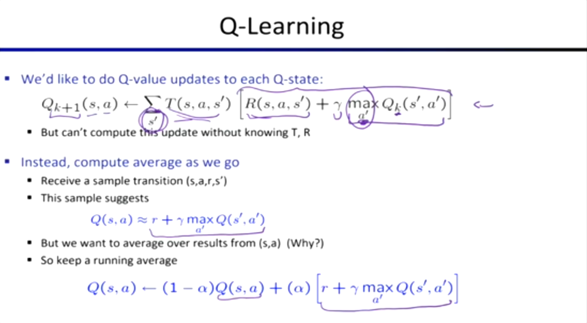
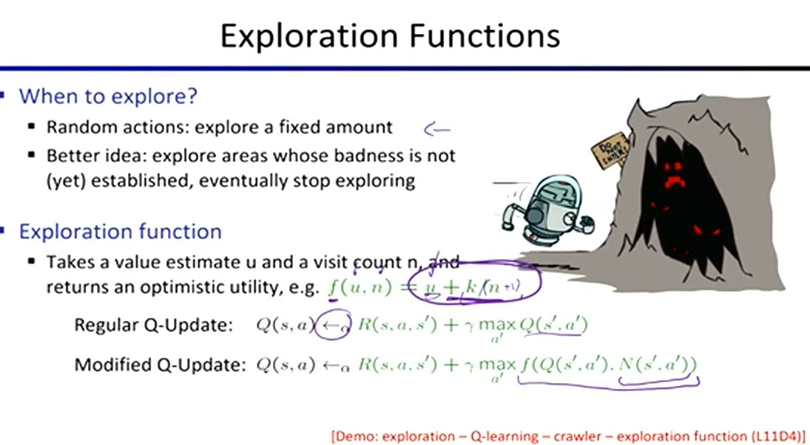

# 强化学习 

# (Reinforcement Learning, RL)

## 核心背景：无模型环境下的试错学习

*   **问题设定：** 我们仍然面对一个马尔可夫决策过程 (MDP) 的环境结构，但现在我们**完全不知道转移概率 $P(s'|s,a)$ 和奖励函数 $R(s,a,s')$**。
*   所以必须通过在环境中**尝试各种动作、经历各种状态**来学习如何做决策。

#### Model-Based Learning 
*   **核心思想：先学规则，再做规划。**
*   **步骤：**
    1.  在环境中四处游荡，收集大量的经验数据 $(s, a, s', r)$。
    2.  利用这些数据，**拟合/估算出一个近似的环境模型**（即计算出经验转移概率 $\hat{P}$ 和经验奖励 $\hat{R}$）。
    3.  把这个估算出的模型当作真实模型，然后**退回到传统的 MDP 求解方法**（如 Value Iteration 或 Policy Iteration），离线算出最优策略。
*   **缺点：** 如果环境极其复杂，拟合出一个完美的模型本身就非常困难，甚至是不可能的。

#### Model-Free Learning 
*   **核心思想：不学规则，直接学“经验直觉”。** 根本不去尝试猜测 $P$ 和 $R$ 是什么，直接在试错中评估状态或动作的好坏。它可以进一步细分为**被动学习**和**主动学习**。

#### 被动学习 (Passive RL) - 策略评估
* 输入一个固定的策略 $\pi$，计算每个状态下的 $V^\pi(s)$，对策略进行评估。

*   **直接评估 (Direct Evaluation):**
    
    *   机械地记录每次经过状态 $s$ 后直到游戏结束所获得的总奖励，然后把所有样本的最终得分加起来**取平均值**。但它孤立地看待每个状态，忽略了状态之间的马尔可夫联系，且在复杂环境中，不可能总是能从同一个状态重复出发很多次来算平均。
    
*   **间接评估 (Indirect / Temporal Difference Learning, TD Learning):**
    
    
    
    *   从每一次单步经验中学习，不需要等游戏结束，只要走了一步 $(s, a, s', r)$，就利用贝尔曼方程的思想，把对未来状态 $s'$ 的估值“回传”给当前状态 $s$，通过**滑动平均**的方式增量更新 $V^\pi(s)$。但 TD Learning 只能评估固定的策略。正如之前讨论的，就算你算出了极其精确的 $V$ 值，由于你没有模型 $P$ 和 $R$，你依然**不知道该怎么改进策略（无法提取 $\pi^*$）**。

#### 主动学习 (Active RL) - 策略改进
*   **Q-Learning (经典表格型无模型学习):**
    *   放弃迭代 $V$ 值，转而直接在探索中进行 **Q 值的迭代更新**。
    

## Q-Learning with exploration

如果在学习初期就完全按照现有的 Q 值贪婪地做决定，智能体极易陷入局部最优。

*   **$\epsilon$-Greedy (带有探索的 Q-Learning)**
    
    *   为了充分探索，在行动时强行加入一点随机性：以较小的概率 $\epsilon$ 随机行动，以较大的概率 $1-\epsilon$ 按当前最优策略行动。
    *   随着时间推移（经验越来越丰富），不断减小 $\epsilon$ 的值，直到完全依赖策略。
*   **Exploration Functions (主动探索函数)**
    
    * 与其盲目掷骰子，不如将“好奇心”量化。将一个奖励探索的函数 $f(u, n)$ 直接写入 Q 值的更新公式中。对于那些去过次数 $n$ 较少的未知区域，给予极高的伪估值。这种“盲目乐观”会驱动智能体主动且笔直地探索地图的每一个未知角落。
    

    

## **Approximate Q-Learning**

*   先从经验中学习较少数量的状态，再将学到的规律**泛化 (Generalize)** 推广到其他相似状态。那就需要用一组特征 (比如“离幽灵的距离”) 来表示各种复杂状态。将 Q 值拆解为这些特征的**线性组合** ($Q = w_1 f_1 + w_2 f_2 + \dots$)。
*   利用 Q-learning 算出的目标值计算误差，将误差对权重求导，通过**梯度下降 (Gradient Descent)** 来更新权重 $w$。这就摆脱了 Q 表的物理限制。

## Policy Search

*   直接从一个尚可的策略方案（一组权重）开始，让智能体跑完几局游戏。然后稍微调整权重（加一点随机扰动），再跑几局。看看会发生什么，如果总得分更高就保留新权重，如果更差就舍弃退回老权重，如此反复重复操作（爬山法 / 策略梯度）。
*   **缺点：**往往需要比 Q-Learning 多得多的经验局数，因为它只能在游戏结束后才知道微调是好是坏。
*   **优点：** 在面对极度复杂、Q 值函数根本无法用特征完美拟合的任务时，直接搜索动作概率反而更容易收敛，也更容易让人理解发生了什么。