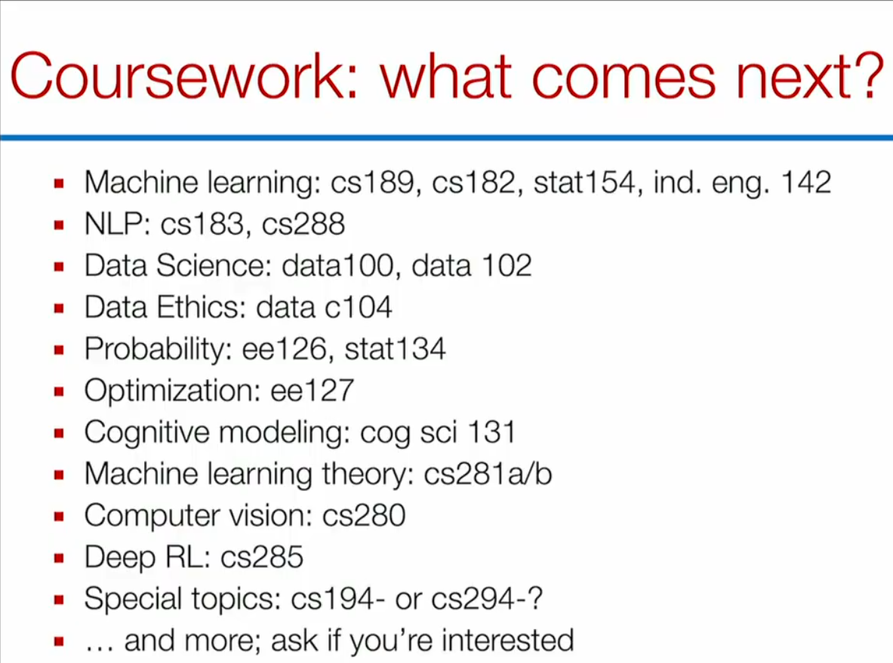

## 多头注意力机制 (Multi-head Attention) 

* 它的一个问题是没有任何硬性的数学约束或机制，能够“绝对保证”每个注意力头一定学到完全不同的特征。在很多训练好的大模型中，有相当大比例的注意力头学到的关系是高度相似甚至重合的（即存在严重的冗余）。
* 目前只能通过**独立的权重矩阵**与**随机初始化**（用于打破对称性），依赖**梯度下降 **与**损失函数 **在训练过程中的自然优化，使模型产生“让不同的头负责不同任务”的强烈倾向。

## AI 绘图模型的局限性

* AI 画图（如生成人体手部）时常出现结构错误（如多根手指），主要归结于两点：
  1. **数据标注不足**：手部结构复杂、遮挡多，缺乏海量且精准的像素级标注数据。
  2. **缺乏三维物理法则**：目前的 2D 生成模型并没有真正理解真实世界的人体骨骼结构、关节限制等物理约束。

## 通用大模型的挑战

#### 1. 行为不可预测与问责机制缺失
* 大模型缺乏传统的工程规范，不像飞机或汽车出现问题时可以一个模块一个模块地排查，大模型是一个巨大的黑盒，一旦出错，开发者无法准确知道问题出在内部的哪个神经元或层级。
* **解决方案**：既然模型**内部**无法实现模块化，那就在模型**外部**做模块化。通过将 AI 应用拆分成**多智能体协作系统 (Multi-Agent System)**，让不同的 Agent 负责不同的具体任务。这样一旦某个环节出错，就能立刻定位到对应的 Agent 并进行干预。

#### 2. 评估标准 (Benchmark) 的失效
* 没有一个标准，无法再用一个单一的标准分数来准确衡量模型的综合表现。以前在 ImageNet 等数据集上一天可以跑十几次实验来调优，现在评估成本极高，往往直到模型在实际部署中出现问题前，都无法察觉其缺陷。
* 并且现代大模型的训练数据几乎涵盖了整个互联网的公开语料。当它做对一道题时，你根本无从知晓它是**真的具备了逻辑推理能力**，还是仅仅在训练时**“背下了这道题的答案”**。

#### 3. 现代大模型的主流评估与测试方法
为了应对上述评估难题，业界演化出了新的测试范式：
* 让两个匿名的大模型同时回答同一个问题，让人类来投票评判哪个更好，以此反映真实的用户体感。
* 利用当前最强的模型（例如 GPT-5）去自动化打分、评估其他模型的输出表现。
* 为了防止模型“背题作弊”，放弃静态的公开数据集，转而使用**不对外公开的、每天实时更新的**测试集，以此来考察模型真正的“现场推理能力”。

---

后续可学习的课程，CS188完结。

