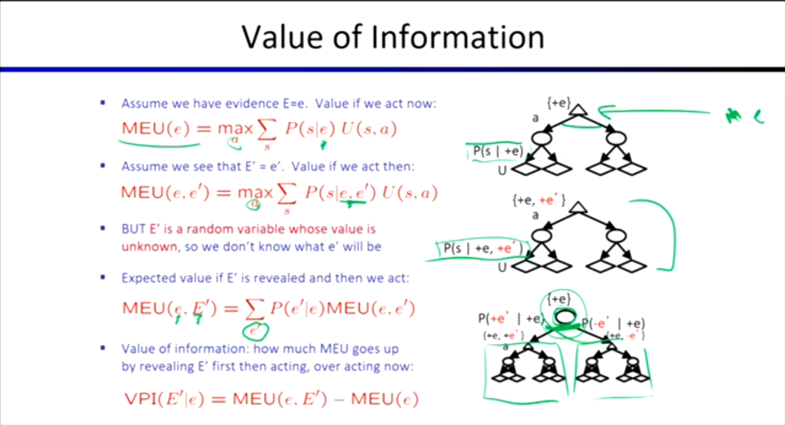
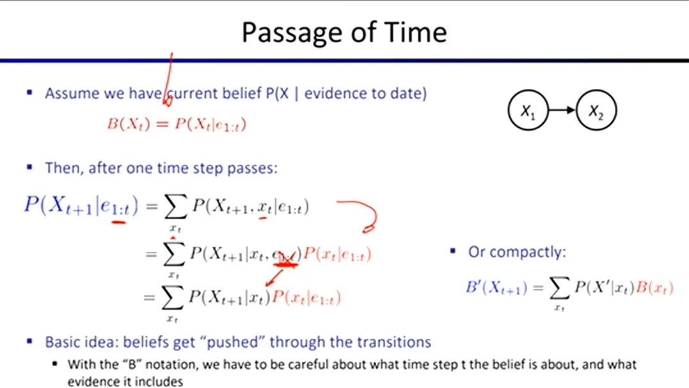
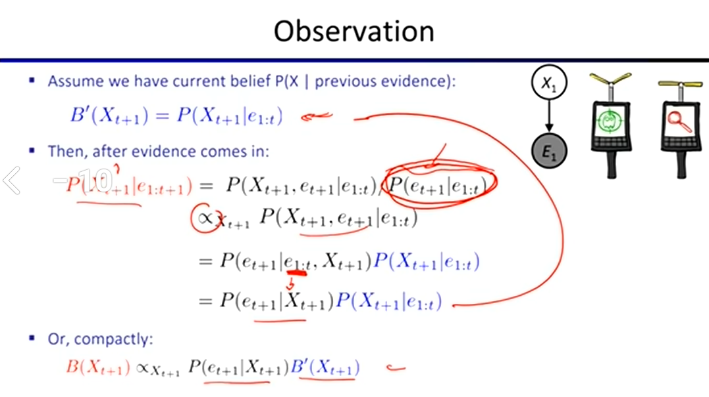
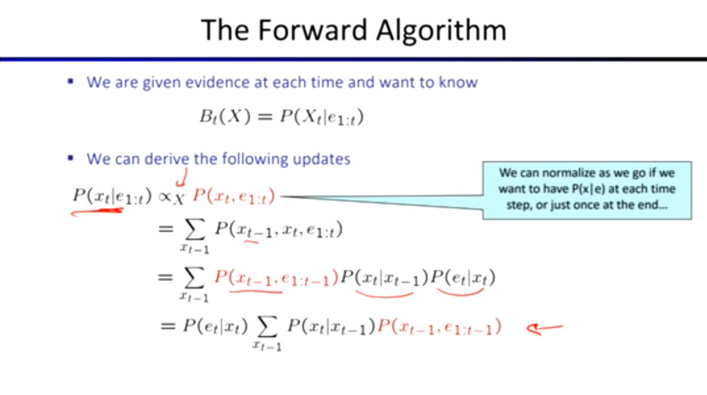

## 完全信息的价值 (Value of Perfect Information, VPI)
不止具体的行动 (Action) 有相应的效用，获取信息的过程也可以计算相应的价值 (Value)，因为**信息会直接影响未来的行动决策**。

* **VPI** = 知道信息 $E$ 后的最大期望效用 (MEU) - 不知道信息 $E$ 时的最大期望效用 (MEU)

* **核心性质**：
  
  * **非负性**：VPI 永远是非负的 ($VPI \ge 0$)，即多知道信息永远不会让情况变得更糟。
  * **不可加性**：VPI 不满足可加性（知道信息 A 的价值 + 知道信息 B 的价值 $\neq$ 同时知道 A 和 B 的价值）。
  

## 平稳分布 (Stationary Distribution)
- 根据马尔可夫链的定理，当时间趋于无限 ($t \to \infty$) 时，状态的概率分布会固定下来，不再随时间变化。平稳分布**与初始状态无关**，只**与转移函数有关**。

* **经典应用**：
  * **Google PageRank**：早期谷歌搜索引擎的核心算法。数学本质上就是求网页链接构成的马尔可夫链的平稳分布概率。直接把算出来的概率当作网页排名的分数，概率越大的网页排得越靠前。
  * **Gibbs Sampling**：吉布斯采样的重复采样过程，其结果表明变量赋值的分布最终将收敛于平稳分布（即真实的后验分布）。

## 隐马尔可夫模型 (Hidden Markov Model, HMM)
除了一系列状态序列，HMM 还可以观察输出。通过观察**证据变量 (Evidence)**，能够推断出**隐藏状态 (Hidden States)** 的后验分布。
* **应用领域**：语音识别、机器翻译、机器人追踪/定位等。

#### 状态追踪的“两步走”过程

* **预测 (Predict)**：在还没看到任何新证据时，根据“现在的信念”，推测下一秒的状态（时间流逝）。

  

* **更新 (Update)**：在下一秒，传感器拿到观测数据，用新证据来更新推测。

  

#### 前向算法 (The Forward Algorithm)

前向算法把“预测”和“更新”这两步揉成了一个可以通过计算机循环迭代的**递归公式**：
* 算法公式中的 **$\sum$ (求和符号)** 以及它后面的部分，代表**时间流逝（预测）**。
* 求和符号外面的 **$P(e_t|x_t)$**，代表**观测（更新）**。
* 等式右边最右侧的项 $P(x_{t-1}, e_{1:t-1})$ 正比于在 $t-1$ 时刻的预测结果 $P(x_t|e_{1:t})$。

#### HMM 的局限性

真实世界的 HMM 状态可能多达几万种（如语音识别），甚至状态空间是无限大、连续的（如机器人定位）。在这种情况下，需要穷举所有状态的前向算法在算力上就彻底报废了。

## 粒子滤波 (Particle Filtering)
为了解决 HMM 在面对海量状态或连续状态时的算力瓶颈，我们只能使用**蒙特卡洛随机采样**的方法来做近似推理，这就是粒子滤波。
* 追踪几十上百个粒子（特定样本），比追踪整个庞大/无限的概率空间要容易得多。
* 将“粒子列表”存储在内存中，这些粒子代表了 Agent 当前的假设，并且总体上代表了信念分布 (Belief Distribution)。
* **执行步骤**：
  1. **Elapse Time (时间流逝)**：根据物理模型，逐个更新/移动列表中的粒子。
  2. **Observe (观测)**：根据传感器获取的数据，为每个粒子计算权重 (Weight)。
  3. **Resample (重采样)**：把权重归一化后，根据权重大小对粒子进行重新采样（淘汰低权重，复制高权重）。

## 同步定位与建图 (SLAM)
* 既不知道地图长什么样，也不知道自己在哪，机器人需要**同时进行定位和地图构建**。
* **主流技术**：
  * 卡尔曼滤波 Kalman filtering (Gaussian HMMs)
  * 粒子方法 Particle methods
* **SLAM 中的粒子含义**：在 SLAM 中，每一个粒子不再仅仅代表一个猜测的坐标，而是代表：**一个猜测的坐标 + 一张它自己画出来的完整地图**。

## 部分可观测马尔可夫决策过程 (POMDPs)
POMDP 是基于**信念状态 (Belief State)** 的 MDP。因为 Agent 并不确定自己目前到底处于什么客观状态，只能根据目前掌握的证据形成一个概率分布。
* 这是一个比普通 MDP 难得多的问题，在计算复杂性理论中属于 **PSPACE-hard**。

#### POMDP = MDP + HMM
* **MDP 侧**：处理动作 (Actions) 和奖励 (Rewards)，负责寻找最优策略。
* **HMM 侧 (Bayes Filter)**：处理隐变量 (Hidden States) 和噪音观测 (Evidence)，负责做概率追踪。

* 它要求 Agent 一边像 HMM 那样根据嘈杂的传感器数据**更新自己的概率信念 (Belief Update)**，一边像 MDP 那样根据当前的信念**选择能拿到最大期望分数的动作 (Action Selection)**。
* 因为求解精确的最优策略太难了，现代 AI 几乎放弃了求绝对最优解，而是大量使用**近似算法**（例如：蒙特卡洛树搜索 MCTS、深度强化学习 Deep RL）。