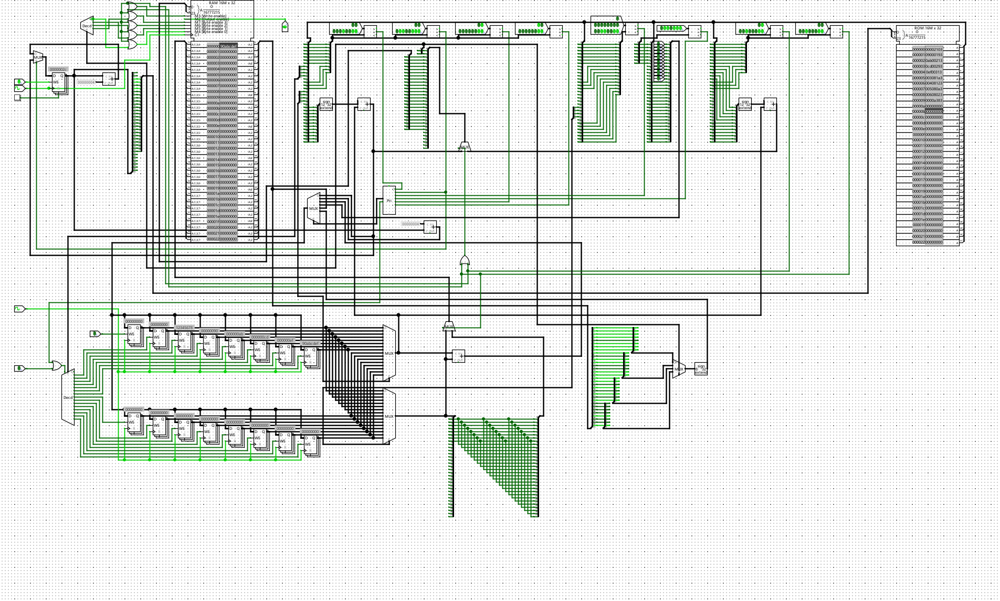

## 实现完整的minirv处理器

#### add

- `add` 指令的编码格式 `0000000 rs2 rs1 000 rd 0110011 ADD`
- 与sISA中的`add`指令非常类似，读取 rs1 和 rs2 寄存器的值，相加后存入 rd
#### lui
- `lui` 指令的编码格式 `imm[31:12] rd 0110111 LUI`  
- 将 imm 作为高 20 位，低 12 位补 0，拼成一个 32 位数，直接存入 rd。

#### lw

- `lw` 指令的编码格式 `imm[11:0] rs1 010 rd 0000011 LW`
- 从内存中加载一个 32 位数值到寄存器 rd 中。有效地址通过将寄存器 rs1与符号扩展后的12位偏移量相加得到，然后将数据从内存复制到寄存器rd。

#### lbu

- `lbu` 指令的编码格式 `imm[11:0] rs1 100 rd 0000011 LBU`
- 类似 `lw`，从内存中加载一个 8 位数值到寄存器 rd 中。

#### sw

- `sw` 指令的编码格式 `imm[11:5] rs2 rs1 010 imm[4:0] 0100011 SW`
- 将寄存器 rs2 低字节中的 32 位数值存储到内存中。

#### sb

- `sb` 指令的编码格式 `imm[11:5] rs2 rs1 000 imm[4:0] 0100011 SB`
- 将寄存器 rs2 低字节中的 8 位数值存储到内存中。



#### 验证


- 在 ram 中存入12345678
```assembly
00:  lw  x2, 0(x0)           # 读整个字：预期 x2 = 0x12345678
00002103
04:  lbu x3, 0(x0)           # 读第0个字节：预期 x3 = 0x00000078
00004183
08:  lbu x4, 1(x0)           # 读第1个字节：预期 x4 = 0x00000056
00104203
0C:  lbu x5, 2(x0)           # 读第2个字节：预期 x5 = 0x00000034
00204283
10:  lbu x6, 3(x0)           # 读第3个字节：预期 x6 = 0x00000012
00304303
```

```assembly
00:  lw   x2, 0(x1)         # 读初始值验证：预期 x2 = 0x12345678
00002103
04:  addi x3, x0, 0x90      # x3 = 0x00000090
09000193
08:  addi x4, x0, 0xab      # x4 = 0x000000ab
0ab00213
0C:  addi x5, x0, 0xcd      # x5 = 0x000000cd
0cd00293
10:  addi x6, x0, 0xef      # x6 = 0x000000ef
0ef00313
14:  sb   x3, 3(x1)         # 把 0x90 写到地址 3 
003081a3
1C:  sb   x4, 2(x1)         # 把 0xab 写到地址 2 
00408123
18:  sb   x5, 1(x1)         # 把 0xcd 写到地址 1 
005080a3
20:  sb   x6, 0(x1)         # 把 0xef 写到地址 0 
00608023
24:  lw   x7, 0(x1)         # 读取新数据：预期 x7 变成 0x90abcdef 
0000a383
```

#### 遇到的一些问题

- 从内存读后八位写入寄存器中扩展为32位时注意不是符号扩展而是直接补0。

- 从寄存器读后八位写入内存中某一位时不知道要写入第几个字节就把其他三个字节也写为这八位。

## 展示

<div style="width: 100%; aspect-ratio: 16/9;">
  <iframe style="width: 100%; height: 100%; border: none;" src="https://www.youtube.com/embed/E7t_j64bTag" title="YouTube video player" allow="accelerometer; autoplay; clipboard-write; encrypted-media; gyroscope; picture-in-picture; web-share" allowfullscreen></iframe>
</div>
