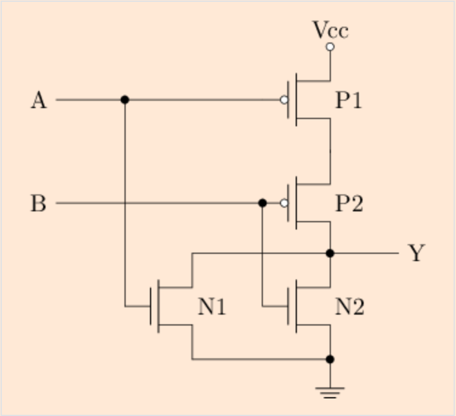
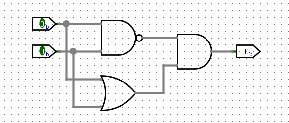
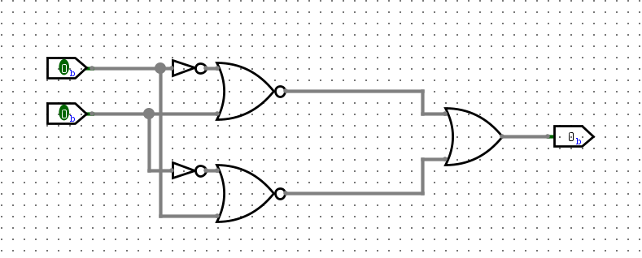
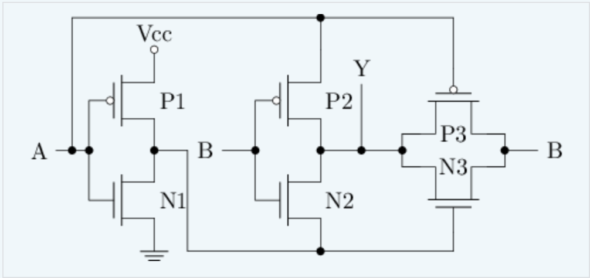
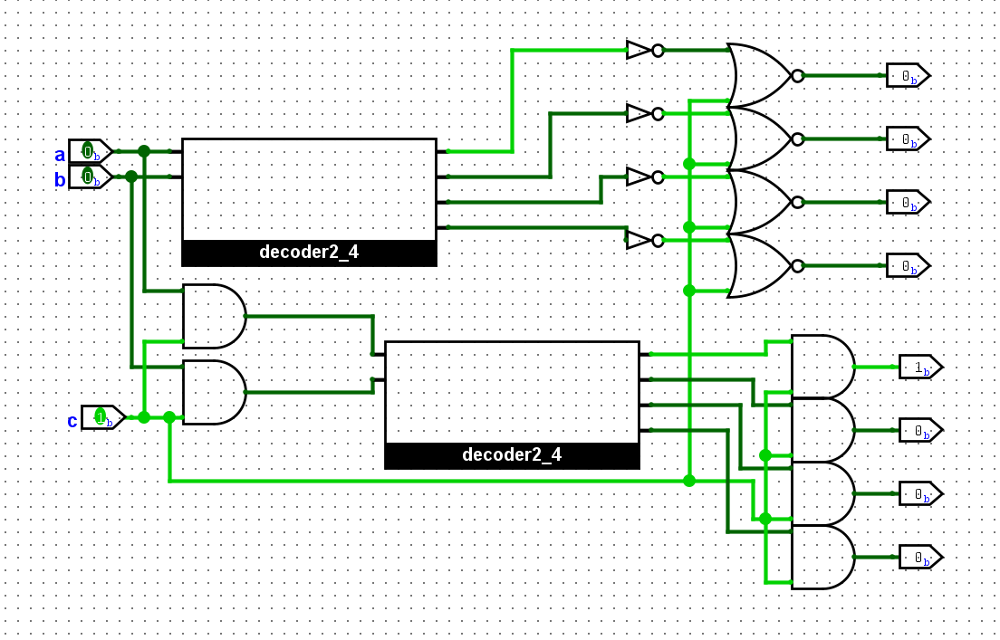
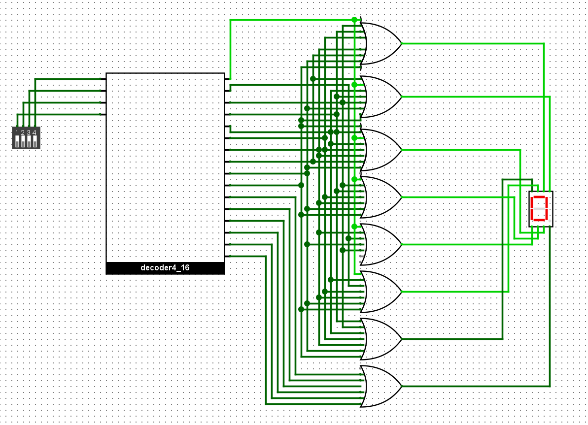
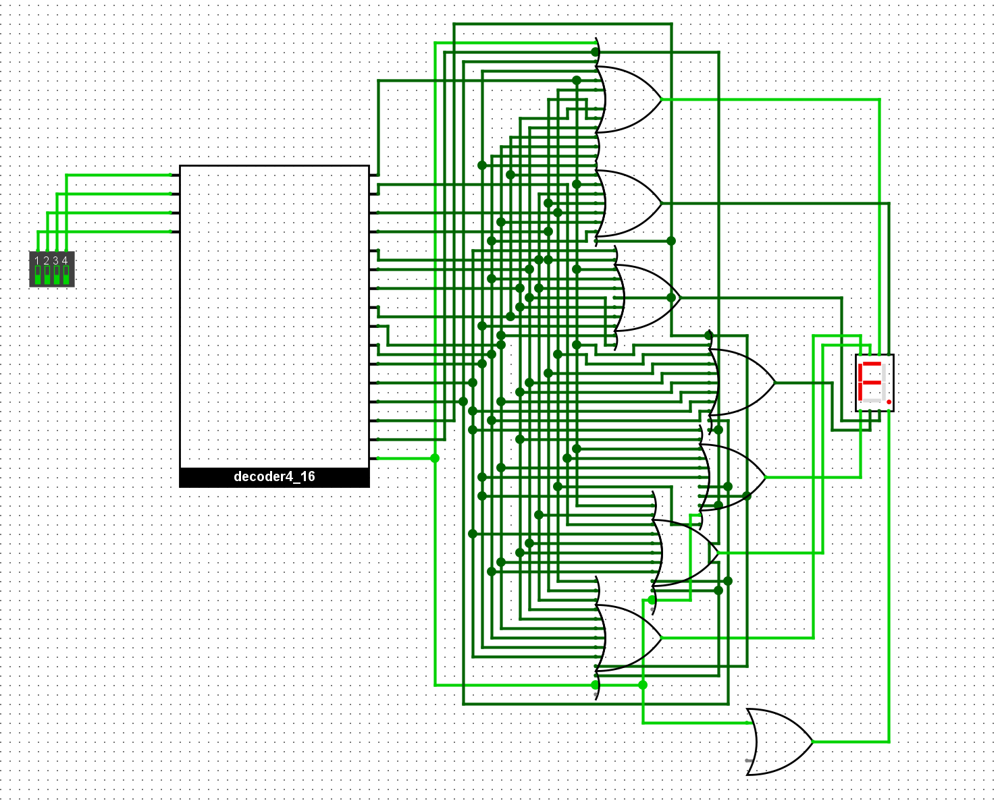
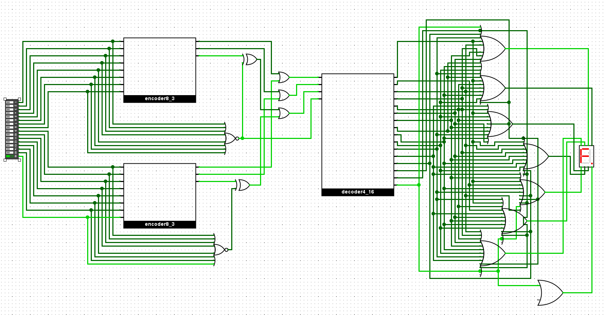

## 分析门电路

这是或非门，即只有两个输入都为0时输出为1，后面接一个非门就能实现或门。

## 异或门的几种尝试

使用16个晶体管的门电路

使用18个晶体管的门电路

经过两天各种尝试还是没能找到14个晶体管实现的方案，先继续学习 f3 剩余内容。

## 异或门的全定制电路

A 输入为1 时，B由左侧电路输入，

A 输入为0 时，左侧电路悬空，B由右侧电路输入

同或门的全定制电路与上图结构类似，改变调换三处位置即可。

## 3-8译码器

使用两个2-4译码器的子电路，和若干个门电路

## 七段数码管译码器

## 七段数码管译码器（2）

## 16-4编码器

