## 4-2优先编码器

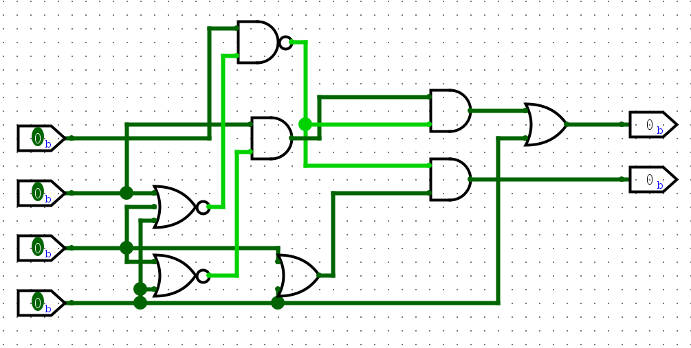

实现 4-2优先编码器 用了8个门电路，相比之下 4-2编码器 只使用了2个门电路。

## 优先编码器的扩展

16-4优先编码器 在 16-4编码器 的基础上将子电路 8-3编码器 替换为 8-3优先编码器 即可。

## 1位2选1选择器

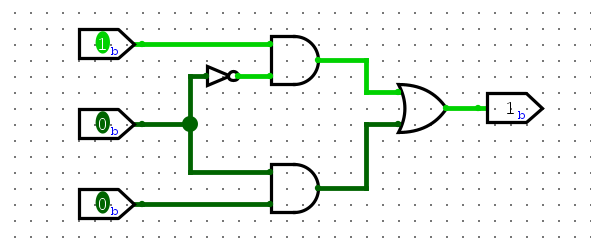

## 3位4选1选择器

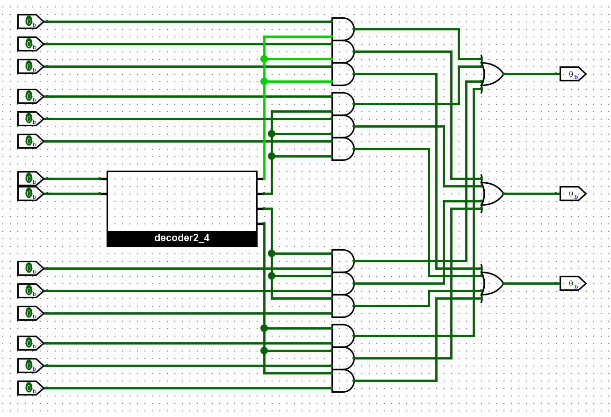

## 可切换进位计数制的七段数码管

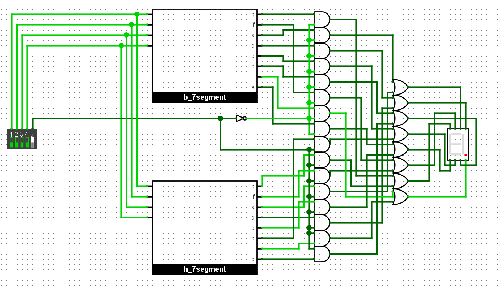

## 比较器

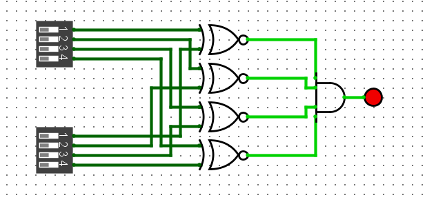

## 1位全加器

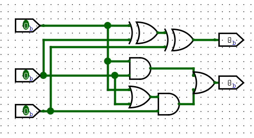

## 1位全加器(2)

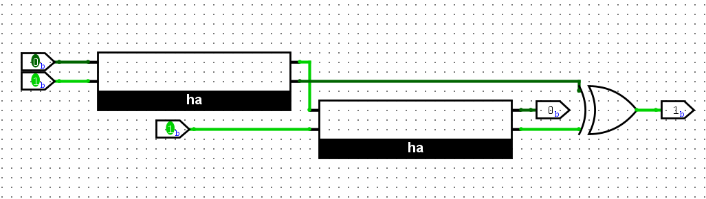

## 四位加法器

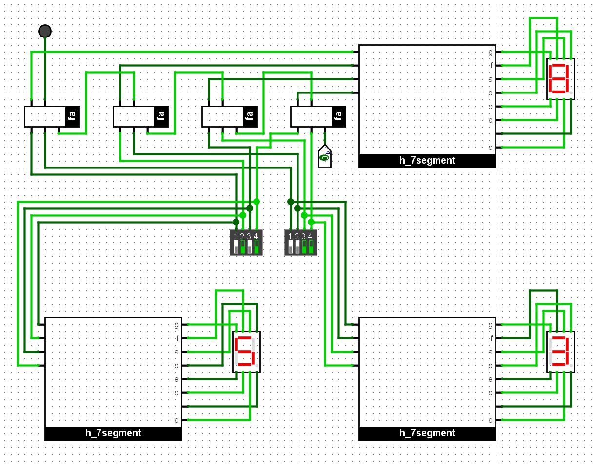

## 四位减法器

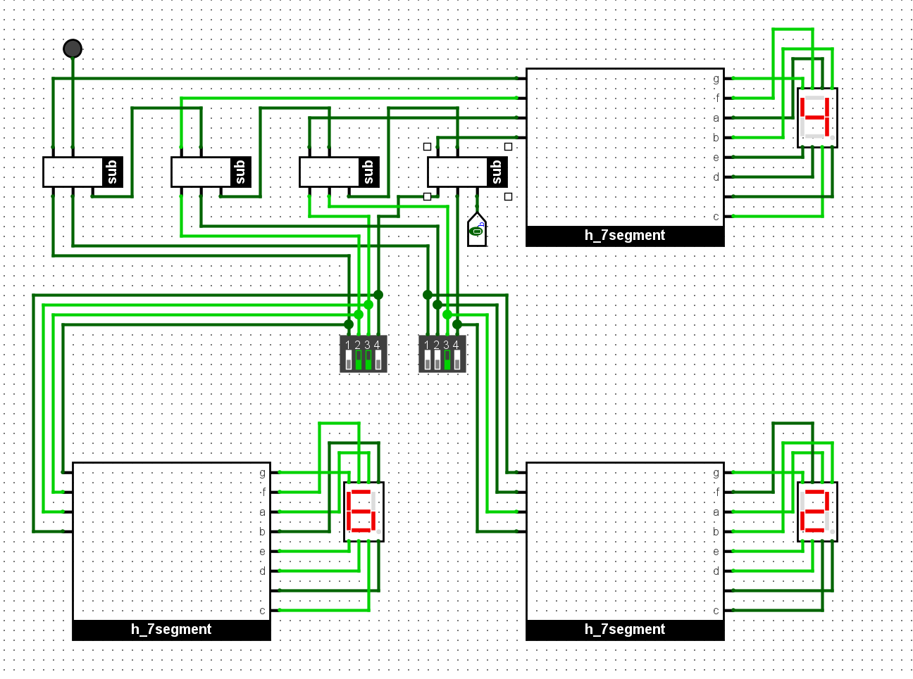

## 4位原码加法器

其实是5位，但逻辑是一样的所以就不改了

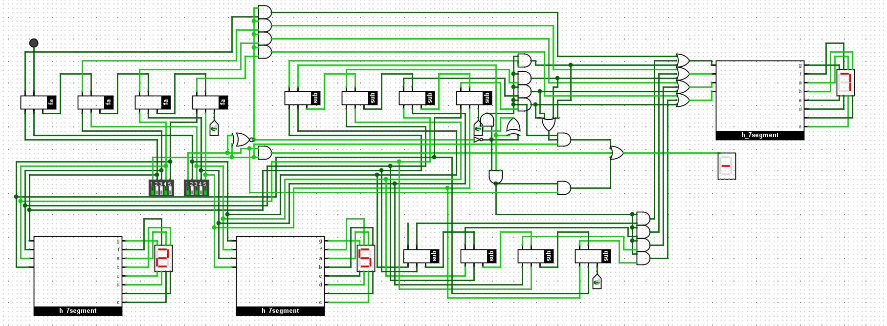

## 4位反码加法器

依然是5位，反码转换为原码, 用原码加法器计算结果, 再转换为反码.

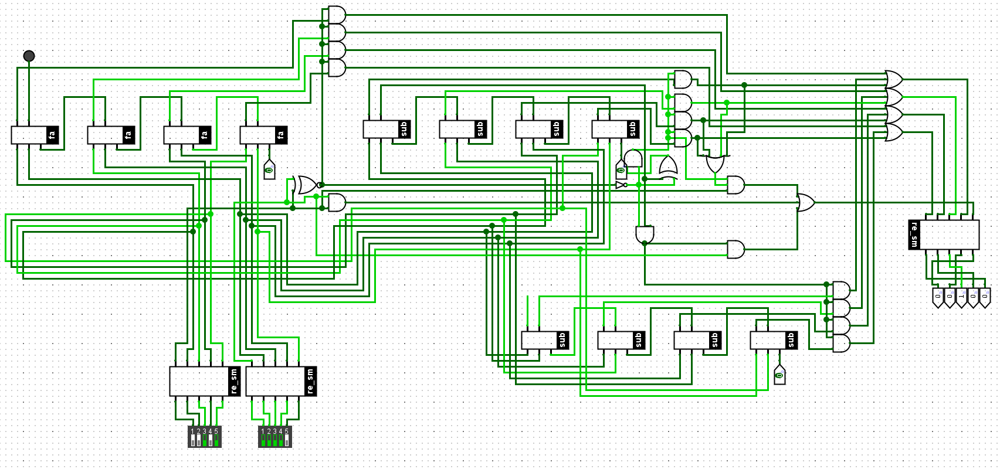

## 4位反码加法器（2）

反码直接使用RCA计算时，只要末位加1就能得到正确的反码加法结果

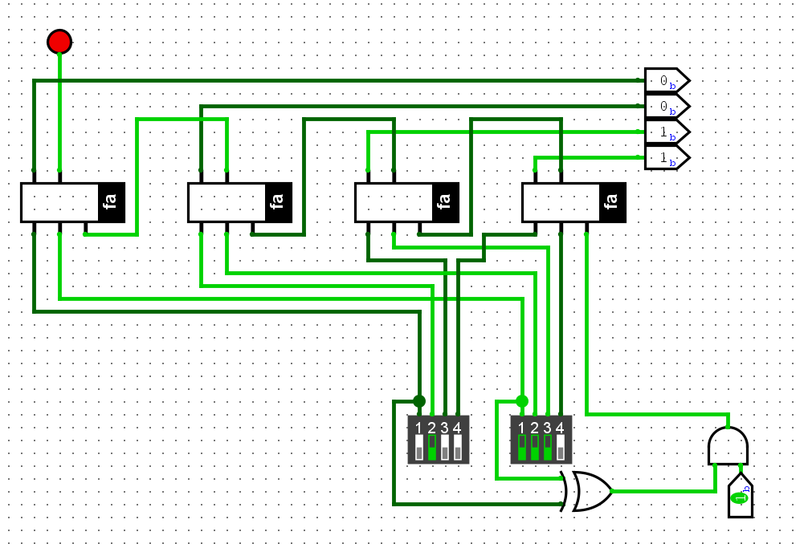

## 检测补码加法是否发生溢出

| `An−1` | `Bn−1` | `Cn−1` | `Cn` | `Sn−1` | 溢出 |
| ------ | ------ | ------ | ---- | ------ | ---- |
| 0      | 0      | 0      | 0    | 0      | 0    |
| 0      | 0      | 1      | 0    | 1      | 1    |
| 0      | 1      | 0      | 0    | 1      | 0    |
| 0      | 1      | 1      | 1    | 0      | 0    |
| 1      | 0      | 0      | 0    | 1      | 0    |
| 1      | 0      | 1      | 1    | 0      | 0    |
| 1      | 1      | 0      | 1    | 0      | 1    |
| 1      | 1      | 1      | 1    | 1      | 0    |

是否溢出 = Cn ^ Cn-1

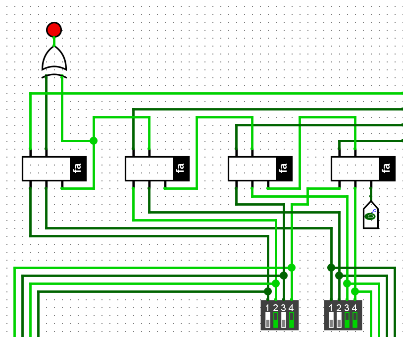