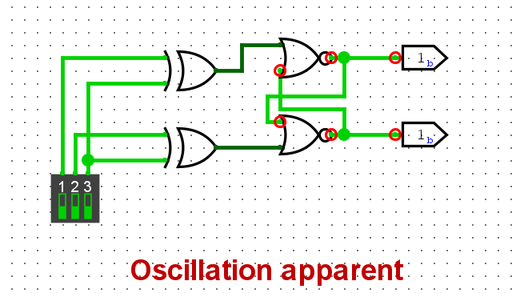
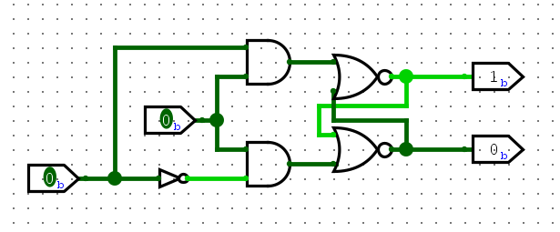
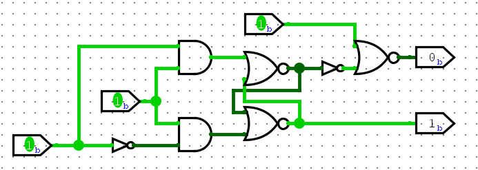
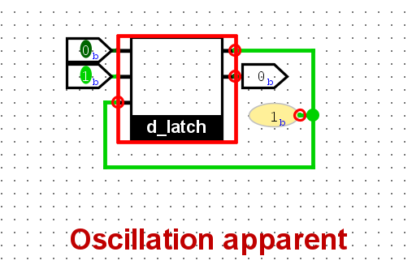
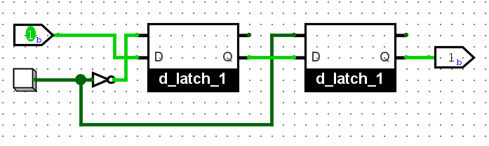
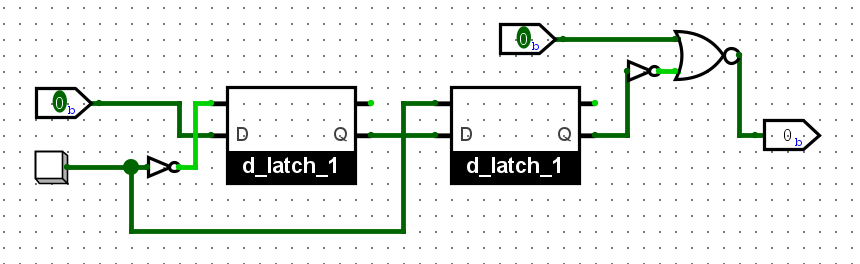
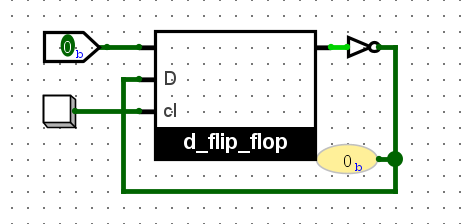
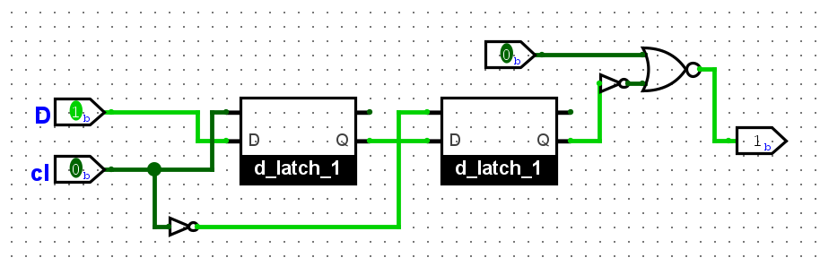
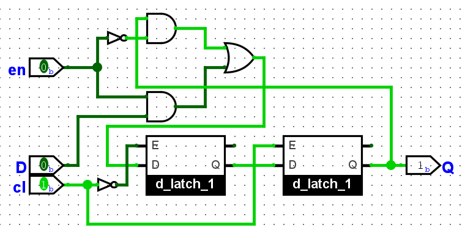
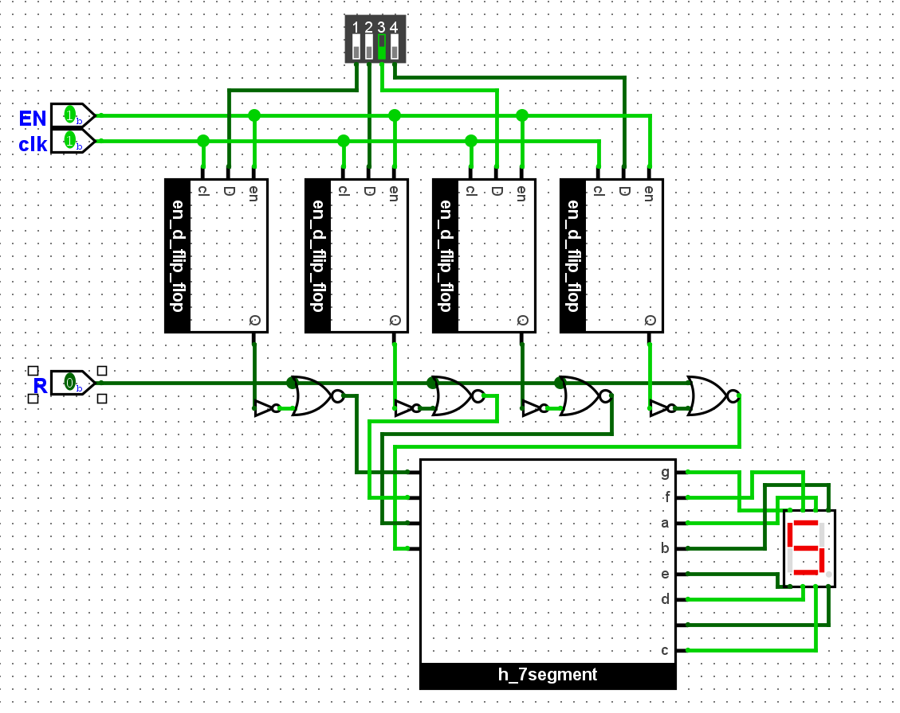

## 搭建SR锁存器

## 用与非门搭建的SR锁存器

| `S`   | `R`   | `Q`                                  |
| ----- | ----- | ------------------------------------ |
| **1** | **1** | **保持**                             |
| **0** | **1** | **0**                                |
| **1** | **0** | **1**                                |
| **0** | **0** | **禁止 **从`00`变成`11` 会触发亚稳态 |

## D锁存器

| `E`   | `D`   | `Q`   | `Q‾`  |
| ----- | ----- | ----- | ----- |
| **0** | X     | **0** | **1** |
| **0** | X     | **1** | **0** |
| **1** | **0** | **0** | **1** |
| **1** | **1** | **1** | **0** |

## 带复位功能的D锁存器

##  用D锁存器实现位翻转功能

- 当 `E=0` 时， `Q` 保持原来的值。即使 `D` 端的信号在变，锁存器也不理会，电路稳定。

- 当 `E=1` 时，`Q` 实时跟随 `D`。而此时 `D` 的值是 `Q‾​`。假设一开始 `Q=0`，那么 `Q‾=1`，反馈到输入端 `D=1`。`Q` 立刻跟随 `D`，变成 `Q=1`。`Q` 变成 1 之后，`Q‾` 就变成了 0，反馈到输入端 `D=0`。`Q` 再次跟随 `D`，又变回了 `Q=0`......无限循环，电路内部的状态就会在 0 和 1 之间来回震荡，出现 **Oscillation apparent**。

锁存器属于电平触发(level-triggered)的存储元件, 只要输入发生变化, 锁存器就能立即感知, 并将该变化传播到输出端。 相比之下, 我们需要一种边沿触发(edge-triggered)的存储元件, 只有信号边沿到来时, 才将输入传播到输出端。

## 搭建D触发器

## 搭建带复位功能的D触发器

## 用D触发器实现位翻转功能

因为D触发器的位翻转受到时钟边沿触发，所以不会像D锁存器的位翻转一样出现明显振荡。

## 搭建下降沿触发的D触发器

## 搭建带使能端的D触发器

## 搭建4位寄存器

