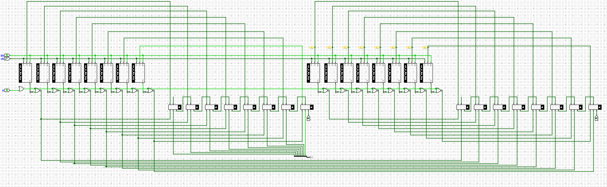

## 继续执行上述指令

```text
PC r0 r1 r2 r3
(0, 0, 0, 0, 0)   # 初始状态
(1, 10, 0, 0, 0)  # 执行PC为0的指令后, r0更新为10, PC更新为下一条指令的位置
(2, 10, 0, 0, 0)  # 执行PC为1的指令后, r1更新为0, PC更新为下一条指令的位置
(3, 10, 0, 0, 0)  # 执行PC为2的指令后, r2更新为0, PC更新为下一条指令的位置
(4, 10, 0, 0, 1)  # 执行PC为3的指令后, r3更新为1, PC更新为下一条指令的位置
(5, 10, 1, 0, 1)  # 执行PC为4的指令后, r1更新为r1+r3, PC更新为下一条指令的位置
(6, 10, 1, 1, 1)  # 执行PC为5的指令后, r2更新为r2+r1, PC更新为下一条指令的位置
(4, 10, 1, 1, 1)  # 执行PC为6的指令后, 因r1不等于r0, 故PC更新为4
(5, 10, 2, 1, 1)  # 执行PC为4的指令后, r1更新为r1+r3, PC更新为下一条指令的位置
(6, 10, 2, 3, 1)  # 执行PC为5的指令后, r2更新为r2+r1, PC更新为下一条指令的位置
(4, 10, 2, 3, 1)  # 执行PC为6的指令后, 因r1不等于r0, 故PC更新为4
(5, 10, 3, 3, 1)  # 执行PC为4的指令后, r1更新为r1+r3, PC更新为下一条指令的位置
(6, 10, 3, 6, 1)......
```

处理器的最终状态为：**(7, 10, 10, 55, 1)**，数列的求和结果保存在 **`r2`** 寄存器中。

## 计算10以内的奇数之和

```
0: li r0, 9
1: li r1, 1
2: li r2, 1
3: li r3, 2
4: add r1, r1, r3
5: add r2, r2, r1
6: bner0 r1, 4
7: bner0 r3, 7
```

## 继续执行上述程序

```c
#include <stdio.h>

/* 1 */ int main() {
/* 2 */   int sum = 0;
/* 3 */   int i = 1;
/* 4 */   do {
/* 5 */     sum = sum + i;
/* 6 */     i = i + 1;
/* 7 */   } while (i <= 10);
/* 8 */   printf("sum = %d\n", sum);
/* 9 */   return 0;
/* 10*/ }
```

```text
PC sum i
(2, ?, ?)    # 初始状态
(3, 0, ?)    # 执行PC为2的语句后, sum更新为0, PC更新为下一条语句的位置
(5, 0, 1)    # 执行PC为3的语句后, i更新为1, PC更新为下一条语句的位置(第4行无有效操作, 跳过)
(6, 1, 1)    # 执行PC为5的语句后, sum更新为sum + i, PC更新为下一条语句的位置
(7, 1, 2)    # 执行PC为6的语句后, i更新为i + 1, PC更新为下一条语句的位置
(5, 1, 2)    # 执行PC为7的语句后, 由于循环条件i <= 10成立, 因此重新进入循环体
......
(6, 3, 2)    # 执行PC为5的语句后, sum更新为 sum+i , PC更新为6
(7, 3, 3)    # 执行PC为6的语句后, i更新为 i+1 , PC更新为7
(5, 3, 3)    # 执行PC为7的语句后, 判断 i<=10 成立, 重新进入循环体
(6, 6, 3)    # 执行PC为5的语句后, sum更新为 3+3=6, PC更新为6
(7, 6, 4)    # 执行PC为6的语句后, i更新为 3+1=4, PC更新为7
(5, 6, 4)    # 执行PC为7的语句后, 判断 4<=10 成立, 重新进入循环体
......
(5, 36, 9)   # 执行PC为7的语句后, 判断 i<=10 成立, 重新进入循环体
(6, 45, 9)   # 执行PC为5的语句后, sum更新为 36+9=45, PC更新为6
(7, 45, 10)  # 执行PC为6的语句后, i更新为 9+1=10, PC更新为7
(5, 45, 10)  # 执行PC为7的语句后, 判断 10<=10 成立, 重新进入循环体
(6, 55, 10)  # 执行PC为5的语句后, sum更新为 45+10=55, PC更新为6
(7, 55, 11)  # 执行PC为6的语句后, i更新为 10+1=11, PC更新为7
(8, 55, 11)  # 执行PC为7的语句后, 判断 11<=10 不成立！循环条件为假，退出循环
```

当程序执行结束时，处理器的最终状态为：**`(8, 55, 11)`**  

## 从状态机视角理解数列求和电路的工作过程



简化为4位的求和过程，共A B C D E F G H 八个寄存器

```text
A  B  C  D  E  F  G  H
(0, 0, 0, 0, 0, 0, 0, 0) 
(0, 0, 0, 1, 0, 0, 0, 0)
(0, 0, 0, 1, 0, 0, 0, 1)
(0, 0, 0, 2, 0, 0, 0, 1) 
(0, 0, 0, 2, 0, 0, 0, 3)
(0, 0, 0, 3, 0, 0, 0, 3)
(0, 0, 0, 3, 0, 0, 0, 6) 
(0, 0, 0, 4, 0, 0, 0, 6)
(0, 0, 0, 4, 0, 0, 0, 10)
(0, 0, 0, 5, 0, 0, 0, 10) 
(0, 0, 0, 5, 0, 0, 0, 15)
(0, 0, 0, 6, 0, 0, 0, 15)
(0, 0, 0, 6, 0, 0, 0, 21)
(0, 0, 0, 7, 0, 0, 0, 21)
(0, 0, 0, 7, 0, 0, 0, 28) 
(0, 0, 0, 8, 0, 0, 0, 28)
(0, 0, 0, 8, 0, 0, 0, 35)......
```

## 几个重要概念

- 编译 = 将C程序翻译成指令序列

- CPU设计 = 根据ISA设计数字电路

- 指令集和处理器是不同层次的概念, 前者是规范, 后者是具体实现。两者各自有3种知识产权模式:
  1. 开放免费(Open & Free), 不花钱就能用
  2. 可授权(Licensable), 花钱就能用
  3. 封闭(Closed), 花钱也不能用
