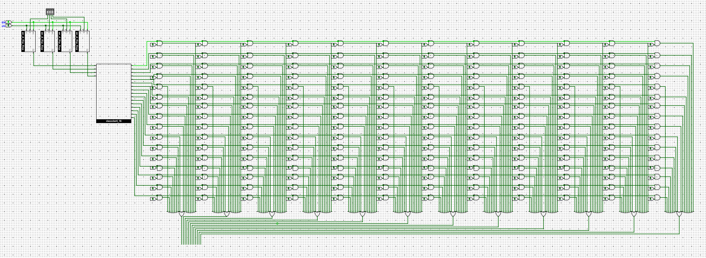
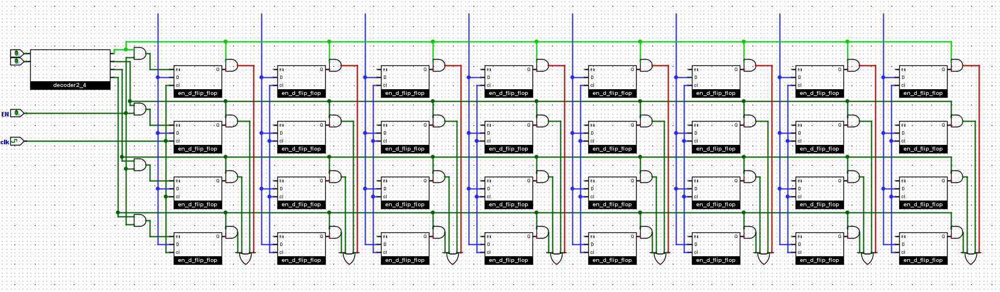
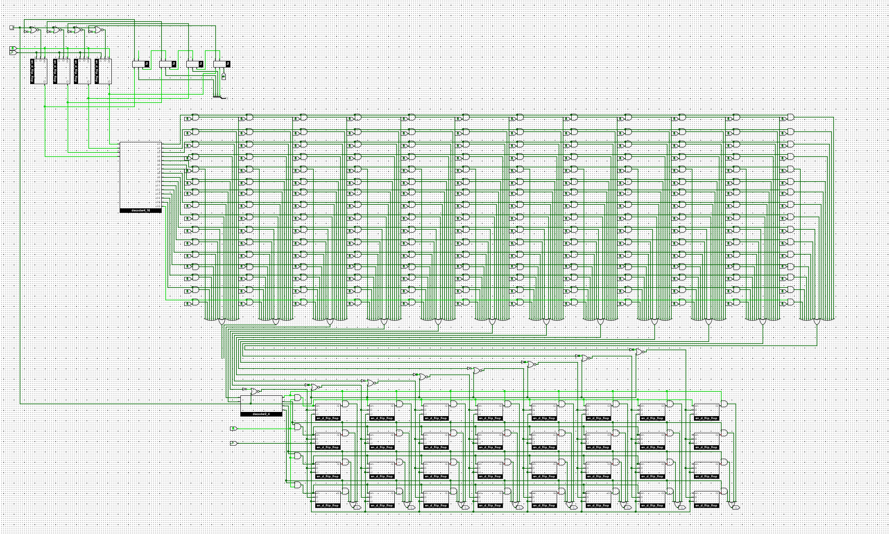

## 实现取指功能

- PC位宽为4位, 初值为`0`
- GPR有4个, 位宽均为8位

数列求和的指令序列：

```text
100000001010    # 0: li r0, 10
100100000000    # 1: li r1, 0
101000000000    # 2: li r2, 0
101100000001    # 3: li r3, 1
00010111    # 4: add r1, r1, r3
00101001    # 5: add r2, r2, r1
11010001    # 6: bner0 r1, 4
11011111    # 7: bner0 r3, 7
```



## 实现GPR及其写入功能

因为是三个寄存器，每个八位，所以是一个 4 x 8 的 RAM。



## 实现仅支持li指令的sCPU




