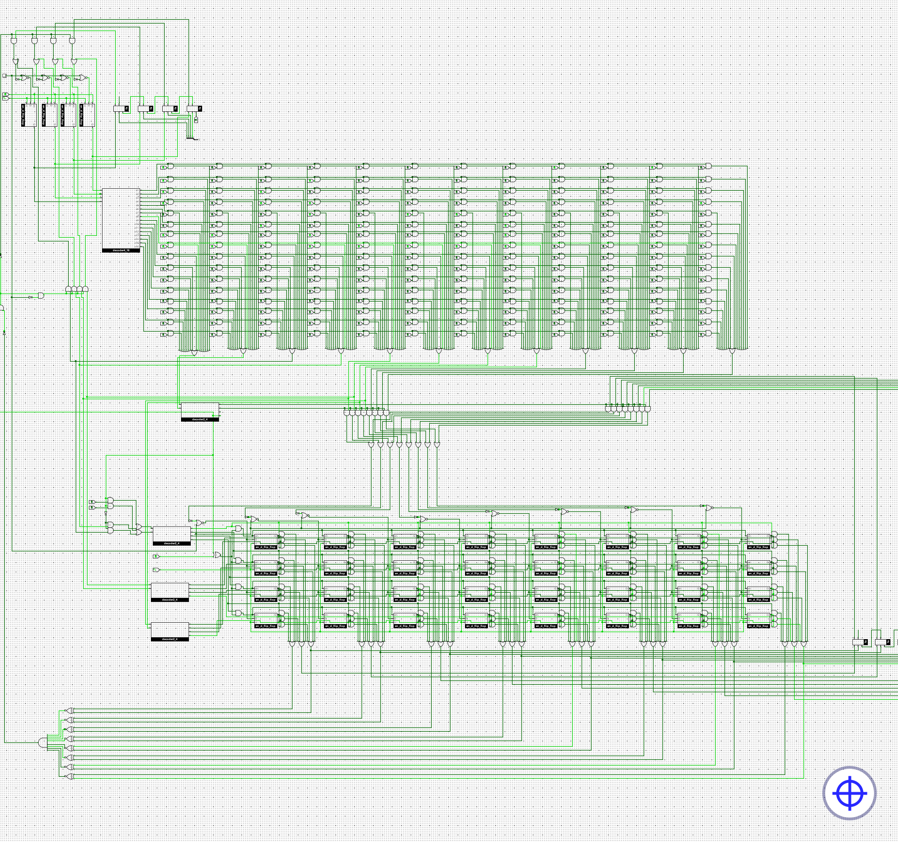
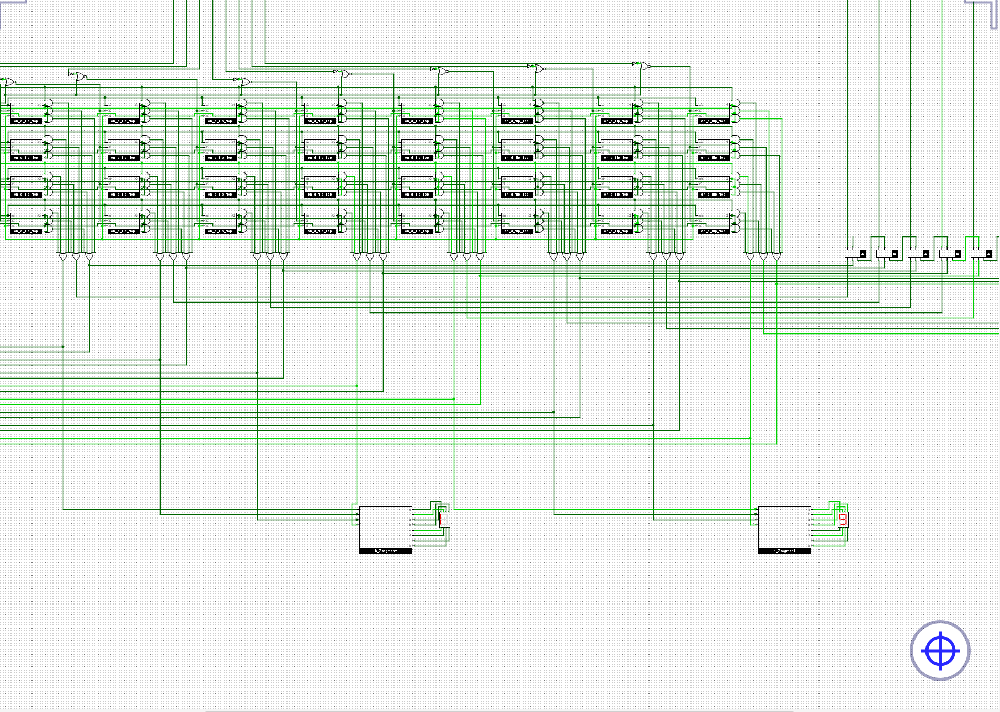

## 添加add、bner0指令



## 和数列求和电路进行对比

- 数列求和电路比较简单，运行速度快，不需要取指、译码等操作，但是功能单一。
- sCPU结构更复杂，运行相对效率更低，需要循环取指、译码、读取、计算、写入的一个过程，但能够实现各种各样的功能，更加通用。

## 重点记录

- 设计数据通路和控制信号, 是CPU设计中最关键的两个步骤

- 在CPU上执行程序 = 用程序编译出的指令序列控制CPU电路进行状态转移

## 计算10以内的奇数之和

```text
100000001001    # 0: li r0, 9
100100000001    # 1: li r1, 1
101000000001    # 2: li r2, 1
101100000010    # 3: li r3, 2
00010111    # 4: add r1, r1, r3
00101001    # 5: add r2, r2, r1
11010001    # 6: bner0 r1, 4
11011111    # 7: bner0 r3, 7
```

用这个指令序列直接输入存储器，不需要做任何其他改变就能实现计算10以内的奇数之和。

- 计算机的"存储程序"意味着没有程序计算机无法运行，只需改变存储的程序而不用修改计算机的硬件结构或电路就能实现各种功能。

## 添加新指令

设置新指令`out rs`，操作码为01，后接两位寄存器地址，将寄存器中的值以十六进制的形式输出到七段数码管。

```text
100000001001    # 0: li r0, 9
100100000001    # 1: li r1, 1
101000000001    # 2: li r2, 1
101100000010    # 3: li r3, 2
00010111    # 4: add r1, r1, r3
00101001    # 5: add r2, r2, r1
11010001    # 6: bner0 r1, 4
0110        # 7: out r2
```




## 能设计一条让10个数相加的指令吗?

可以但是不合理，

- 存储程序式计算机的重点就在于将一个复杂任务拆解可复用的一个个微小的操作指令，这样一条指令无法适用于其他更广泛的任务。
- 指令集指令数量很有限，应该精简避免不必要的指令，用于更通用操作。

- 电路设计上，如果要在一个完成十次加法，那么就需要十个加法器的冗叠和极低的主频，若在多个周期完成则涉及复杂的控制逻辑。