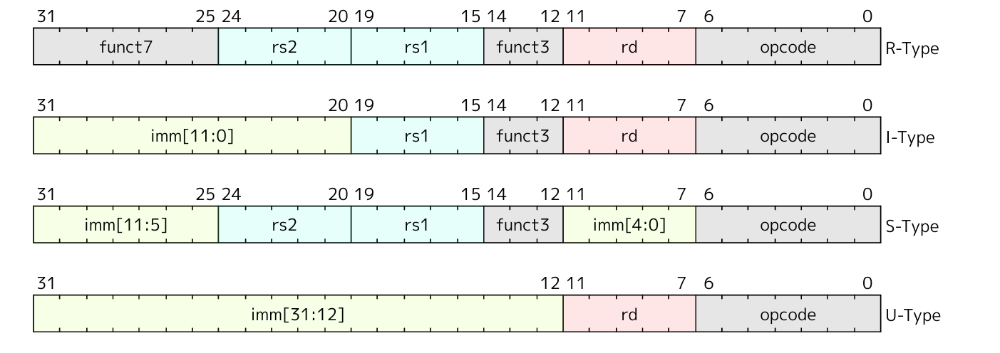
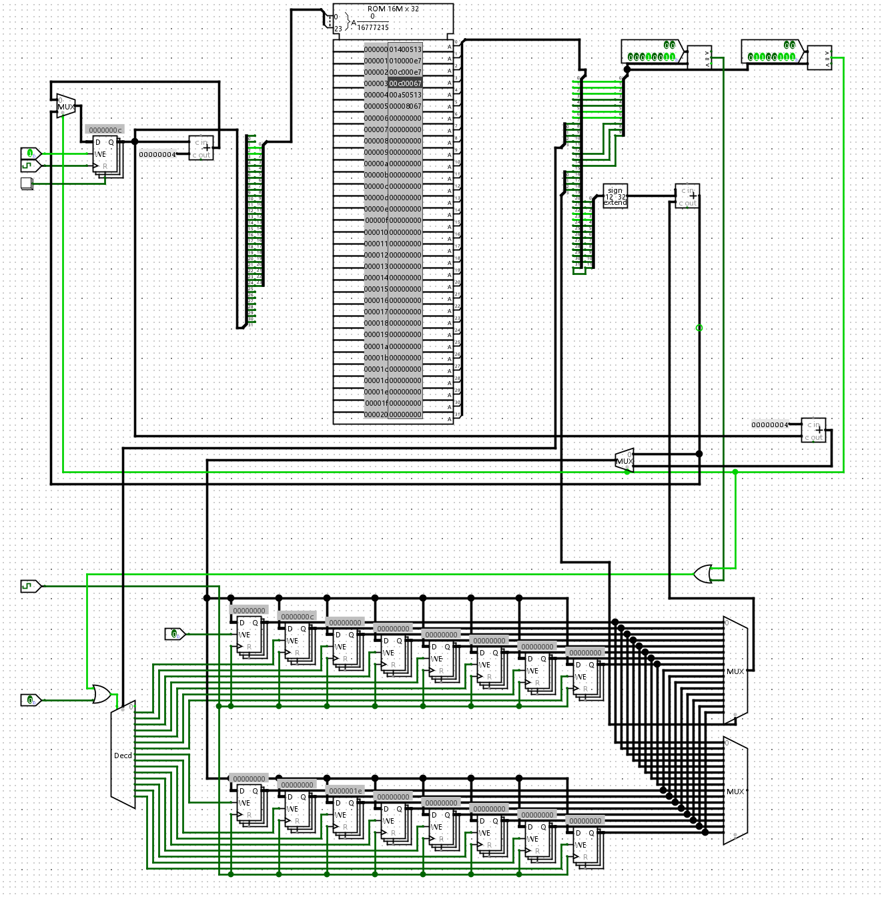

## 通过RTFM初步了解RISC-V指令集

- PC寄存器位宽 32 位，**X0-X31** 共 32 个GPR，每个 32 位宽。

- 指令编码的位宽 32，有以下四种基本格式

- RV31I的 `R[0]` 所有位硬接线为0，sISA的`R[0]` 就是指第一个GPR。
- 指令的基本格式中, 需要 5 位来表示一个GPR，因为 5 位二进制数范围就是0-31。

- `add`指令的格式是 `0000000 rs2 rs1 000 rd 0110011` 。
- RV32E 是面向嵌入式系统中微控制器设计，RV31I的精简版本，唯一的改变是将GPR的数量减少到 16 个 (**x0-x15**)。

## minirv的规范

- PC初值为 `0`
- GPR数量 `16`
- 支持如下8条指令: `add`, `addi`, `lui`, `lw`, `lbu`, `sw`, `sb`, `jalr`
- 其他的ISA细节与RV32I相同

## 存储

- 内存中的一个**字**被定义为 32 个比特（即 4 个字节）。
- 内存地址空间是环形的，因此最后一个地址处的字节与地址 0 处的字节相邻。硬件执行的内存地址计算会忽略溢出，按照取模结果进行回绕。

## 实现两条指令的minirv处理器

#### addi

- `addi`指令的编码格式 `imm[11:0] rs1 000 rd 0010011 ADDI`

- ADDI 指令会把那个 12 位的立即数进行符号扩展后，和 rs1 寄存器里的值相加，写入目标寄存器 **rd** 里。算术溢出，最终结果只保留计算结果的最低 XLEN（比如 32）位。**ADDI rd, rs1, 0** 这条指令用于实现汇编语言里的 **MV rd, rs1** 伪指令。

#### jalr

- `jalr`(jump and link register)指令的编码格式 `imm[11:0] rs1 000 rd 1100111 JALR`
- 将符号扩展的12位立即数与寄存器rs1相加，然后把结果的最低有效位设为0得到目标地址。下一条指令地址（pc+4）被写入寄存器rd。若无需返回，可将寄存器x0用作rd。

#### 测试程序

```assembly
00000000 <_start>:
   0:	01400513          	addi	a0,zero,20  # 0 + 20 存入 a0
   4:	010000e7          	jalr	ra,16(zero) # 10 <fun> # 跳转到 16 + 0 处即执行 fun 函数
   														   # 将下一条指令的地址存入 ra
   8:	00c000e7          	jalr	ra,12(zero) # c <halt> # 跳转到 12 + 0 处即执行 halt 函数

0000000c <halt>:
   c:	00c00067          	jalr	zero,12(zero) # c <halt> # 跳转到 12 + 0 处在 halt 函数中无限循环

00000010 <fun>:
  10:	00a50513          	addi	a0,a0,10    # a0 + 10 存入 a0
  14:	00008067          	jalr	zero,0(ra)  # 跳转到 ra + 0 处
```

最后寄存器 `a0` 中的值为30，程序停止在 `0000000c` 处无限循环。



## 测试 addi 指令

```assembly
	0:	addi r1,r0,-1
111111111111 00000 000 00001 0010011 	# FFF00093

	4:	addi r2,r0,10 
000000001010 00000 000 00010 0010011 	# 00A00113

	8:	addi r2,r2,-15 
111111110001 00010 000 00010 0010011 	# FF110113
```

放置到ROM中，结果与预期相符，实现正确。

