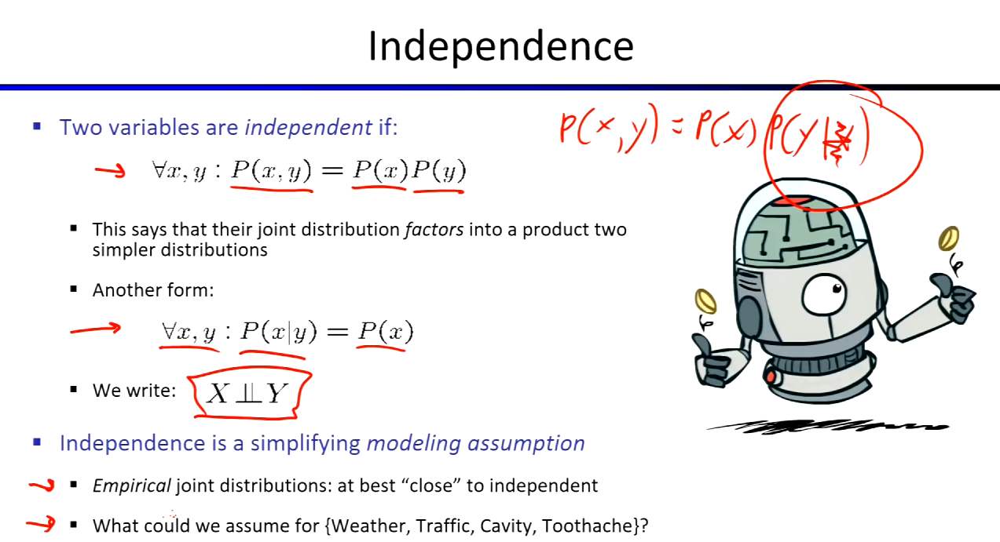
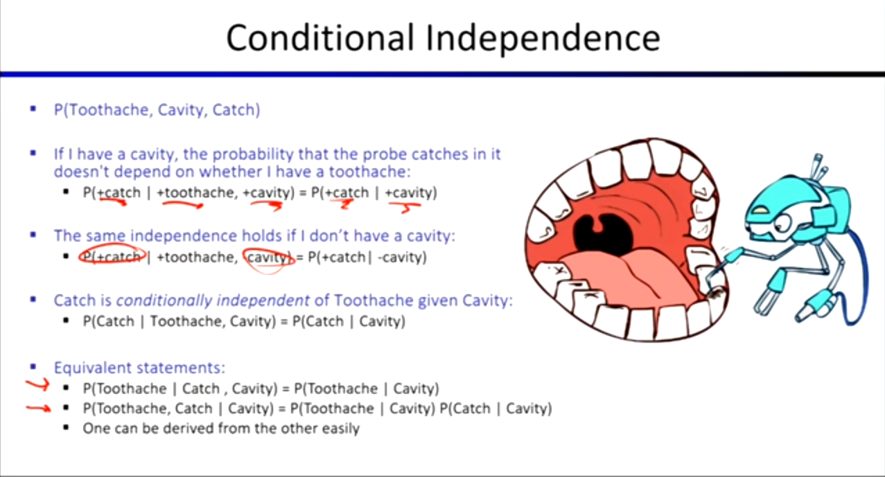
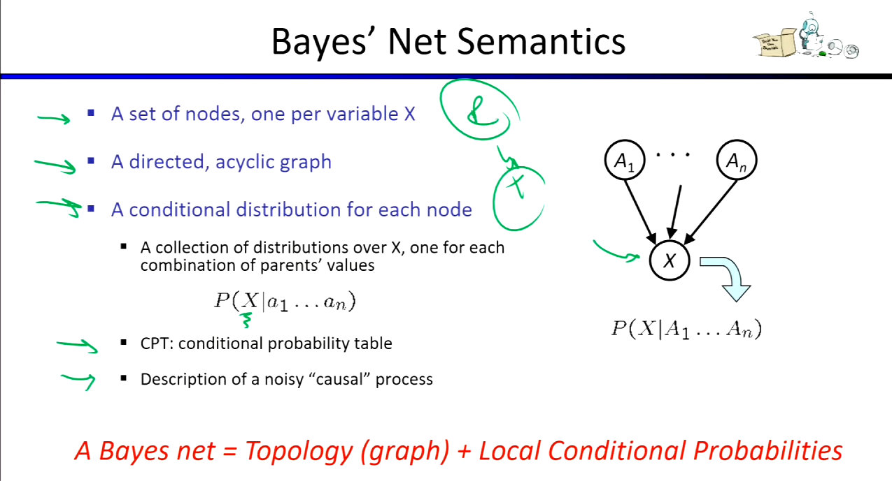

## 概率分布

*   **联合分布 (Joint Distribution)** 是概率模型的核心。它描述了所有变量所有可能组合的概率。
*   **边缘分布 (Marginal Distribution)** 是从联合分布推导（通过求和或积分）而来，描述单个或部分变量的概率分布。
*   **条件分布 (Conditional Distribution)** 描述在已知某些变量发生的情况下，其他变量发生的概率。
    *   **计算公式:** **条件概率 = 联合概率 / 边缘概率**。

## 概率推理与贝叶斯公式

*   **概率推理 (Probabilistic Inference):** 通过其他已知概率，计算出一个我们想要知道的未知概率的过程。
*   **贝叶斯公式 (Bayes' Rule):**
    *   让我们能够通过**反向的条件概率**推导出**正向的条件概率**。
    *   通常其中一个方向的条件概率非常难算（或难以直接获取数据），但反过来的那个条件概率却极其简单。

## 独立性与条件独立性

*   **独立性 (Independence):** 是一种为了简化模型而做出的假设。
    
    *   如果两个变量独立，则它们的**联合概率等于边缘概率的乘积**：$P(X, Y) = P(X)P(Y)$。
    
    
    
* **条件独立性 (Conditional Independence):** 同样也是一种用于简化模型的假设。

  

  *   即使两个变量在全局上不独立，在**给定某个特定条件**下，它们可能是独立的。
  *   这种假设可以通过不同的数学等价方式来表达（例如：$P(X|Y,Z) = P(X|Z)$ 等价于 $P(X,Y|Z) = P(X|Z)P(Y|Z)$）。

## 贝叶斯网络 (Bayesian Net)

*   **定义:** 贝叶斯网络被称为**概率图模型 (Graphical Models)**，它是一种帮助我们表达“条件独立性假设”并以图形方式直观思考它们的强大工具。
*   **核心原理:** 使用简单的**局部分布**来描述变量间的**局部相互作用**，从而达到建模极其复杂的**联合分布**的目的。
    *   只要将网络中每个节点的条件概率表 (CPT) 相乘，就能精确还原出完整的联合分布：$P(x_1, \dots, x_n) = \prod_{i} P(x_i | Parents(x_i))$。
*   这个拓扑图实际上是在精确描述变量之间的**条件独立性结构**。节点间的箭头在纯数学上**只能反映相关性**，而绝对**不能保证反映因果关系**。虽然数学上可以随意画箭头，但当贝叶斯网络的结构设计**反映了现实世界的真实因果关系**时，该网络（包含的条件概率表）通常会变得**更简单（参数更少）**，也更容易想到和理解。