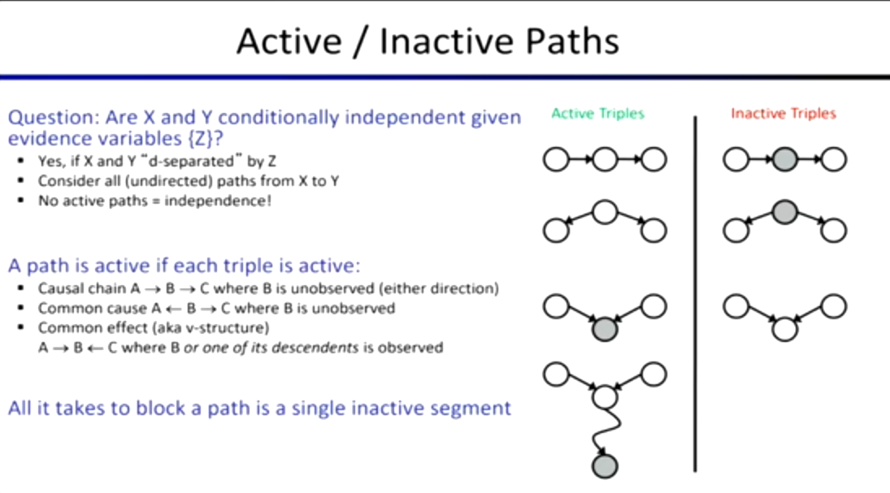

## 贝叶斯网络的优势

- 在处理 $N$ 个布尔变量的概率模型时，**联合分布表** 大小为 $O(2^N)$。随着变量增加，呈指数级爆炸。而**贝叶斯网络** 在假设规定每个节点最多有 $k$ 个父节点下，规模为 $O(N \cdot 2^{k+1})$。

*   贝叶斯网络通过引入**局部条件独立性**假设，将原本需要指数级内存的联合概率大表，压缩成了很多张小型的条件概率表（CPTs）。这成功地将空间复杂度降成了随节点数**线性增长**的级别（假设 $k$ 为常数）。

## **D-分离 (D-Separation)** 

- 如何提出图算法来得出贝叶斯网络中变量之间的独立性结论呢？
- 给定证据变量集合 $Z$，询问 $X$ 和 $Y$ 是否条件独立，我们将检查x和y之间的所有路径，并检查该路径上每一个三元组是处于**激活状态**还是**非激活状态**。每当我们得到一条路径时，我们都会把他们分成三元组，这些重叠的三元组共同构成一条完整的路径。有一个三元组非活跃状态则该路径是非活跃状态，只有所有路径都属于非活跃状态时，才能得出独立。

#### 三种基础三元组结构的通行规则

对于路径上的任何一个三元组（假设中间节点为 $Y$），其连通性规则如下：

1.  **因果链 (Causal Chain):** $X \rightarrow Y \rightarrow Z$
    *   **规则:** 观察中间节点 $Y$ 后，路径被阻断。即给定 $Y$，$X$ 和 $Z$ 独立（Inactive）。
2.  **共同原因 (Common Cause):** $X \leftarrow Y \rightarrow Z$
    *   **规则:** 观察中心节点 $Y$ 后，路径被阻断。即给定 $Y$，$X$ 和 $Z$ 独立（Inactive）。
3.  **共同结果 / V型结构 (Common Effect / v-structure):** $X \rightarrow Y \leftarrow Z$
    *   **规则 (反直觉):** **未观察** $Y$ 时，路径是不通的（独立）。一旦**观察**了 $Y$（或其任何后代节点），路径反而被打通。即给定 $Y$，$X$ 和 $Z$ 变得相关了。

## 图的拓扑结构与表达能力

贝叶斯网络中箭头的存在与否，直接决定了模型表达概率分布的能力和自由度。

*   **没有箭头**，意味着两个变量之间被强行施加了**绝对独立**的数学约束。这种图的自由度极低，只能表达最简单的情况。
*   **加上箭头** ，意味着**允许**两个变量之间存在相关性，赋予了模型更大的自由度（表达能力更强）， **只需要把条件概率表里的那些依赖关系全填成一样的值（就和没有箭头一样了）**。

- **全连接图（有很多箭头）可以通过巧妙地填写概率表，完美模仿出独立图（没有箭头）的所有行为，表达能力更强。**

- **所以一个贝叶斯网络的联合分布可能存在进一步的（条件）独立性，这种独立性直到你检查它具体的概率分布数字时才能被发现。**边数越多、箭头越密集的图，所能表达的概率分布集合就越大，并包含了边数少的图所能表达的集合。

## 小结：

*   通过 **D-Separation (图结构)** 找出来的独立性，是**绝对靠谱**的。图论算法说它们独立，那在数学上就必定独立。
*   但是，当图论算法说“不独立”时，因为**一个贝叶斯网络的联合分布可能存在进一步的（条件）独立性**，这种暗藏的独立性直到你检查它具体的概率分布数字时才能被发现。